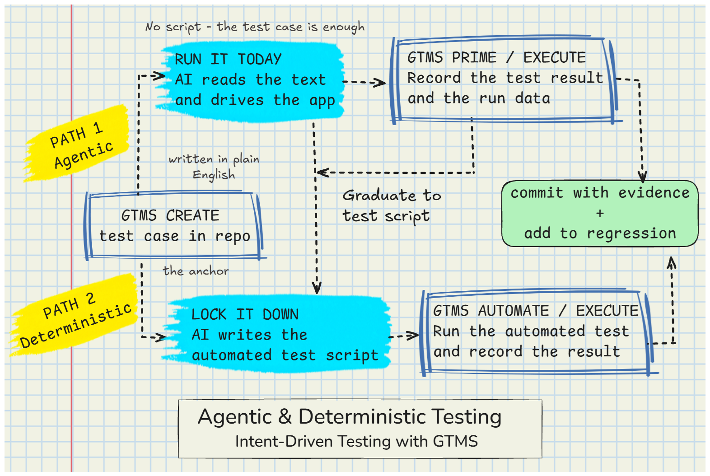

# GTMS: Git-based Test Management System

> *Agentic test coverage today. Deterministic when it matters most.*

GTMS tracks your testing the way git tracks your code. Plain-text markdown test cases, automation, and results in your repo. Its job is orchestration. Use AI to write your test case. Then an AI agent runs the test case agentically today, driving your app for test coverage with no script. Next GTMS promotes it to a deterministic script when you're ready. Lock the test case down when you need deterministic consistency. One test case, two paths, your call.

<p align="center">
  
</p>

## Get Started in 3 Steps

_Plug GTMS into your AI coding agent and it takes it from there..._

| Step | What to do |
|------|------------|
| **1** | **Download** the binary from [GitHub Releases](https://github.com/aitestmanagement/gtms-cli/releases) |
| **2** | **Drop** `gtms.exe` (or `gtms` on macOS/Linux) into your repo |
| **3** | **Tell your AI agent** to run `gtms.exe agent` |

That is the whole setup. Your agent reads GTMS's built-in operating guide and drives the pipeline for you: configure the adapters, wiring the automation, writing your first tests, running them and recording the results. 

Want to drive it yourself instead? See [Install](#install) and [Quick Start](#quick-start) below.

## Intent Outlives Implementation

A test case captures **intent**: what should be true, in the plain language testers have written for decades. *How* that intent gets checked is a separate, swappable thing:

- A **human** works through the case and records the result.
- An **AI agent** runs it agentically and documents what it observed: real coverage, no code or script.
- A **deterministic script** gets written and locks it down, once you need the consistency of a coded test.

Same case. Same ID. Same history. The implementation graduates (`[manual] → [playwright]`), but the intent is the durable layer underneath. That is **Intent-Driven Testing**: fast coverage now with AI, consistent coded coverage when you're ready. The test case is the constant; the implementation is swappable.

You see the whole ladder in one place, with `gtms status`:

```text
TEST CASE                         CREATE  AUTOMATE  EXECUTE  LAST RESULT

tc-a3f72b10  valid-login          ✓       ✓         ✓        pass [playwright]
tc-b2c3d4e5  remember-me          ✓       —         ✓        pass [manual]
tc-c5d6e7f8  invalid-password     ✓       ✓         ✓        pass [playwright]
tc-d8e9f0a1  account-lockout      ✓       ●         —        —

  ✓ complete   ● in progress   ○ pending   — not started   ✗ failed   ⊘ skipped
```

The `remember-me` test case was executed by hand (or agentically by AI): a real result, no automation script. `valid-login` graduated to a Playwright spec. Same table, same history, whichever rung a case sits on.

GTMS owns the artefacts on disk. It oversees the test cases, the wiring to code/scripts, the test results. It tracks the workflow and overall status. You bring your own tools and plumb into your infrastructure.

## Three Ways To Work, One Command Surface

The same GTMS commands and the same plain-text files serve three modes, and a single project can use all three:

- **Manual CLI**: you run the commands and point at relevant files. No AI. Built-in adapters stamp all the required templates and you edit the files. Just like manual test case management but managed by Git and ready for AI.
- **Adapter-orchestrated**: GTMS dispatches adapters you configure in `gtms.config`: a framework runner, prompts for AI to write test cases, MCP connections to Jira, a remote service, your own AI coding tools. The mode for headless and team orchestration.
- **Inline agent**: an AI coding agent (e.g. Claude, Codex) already working in your repo runs the `gtms` commands as it builds out a test pack, uses agentic loops to test app changes and write test scripts.

## Install

GTMS ships as a single self-contained executable. No installer, no runtime, no DLLs. The fastest way to start is to download it, drop it into your project and run it from your project folder.

**Run it straight away (no install):**

Download the latest release from [GitHub Releases](https://github.com/aitestmanagement/gtms-cli/releases), unzip it, and drop `gtms.exe` (or `gtms` on macOS/Linux) into your project folder. Run it from there, no PATH setup required:

```powershell
.\gtms.exe version    # PowerShell (the Windows default)
```

```bat
gtms.exe version      # cmd.exe
```

```bash
./gtms version        # macOS / Linux
```

Every `gtms ...` example in this README works the same way from that folder: read them as `.\gtms.exe ...` (PowerShell), `gtms.exe ...` (cmd), or `./gtms ...` (macOS/Linux).

On Windows, release binaries are **not code-signed**, so SmartScreen shows *"Windows protected your PC"* with **Unknown publisher**. This is expected. Click **More info → Run anyway**, or avoid the prompt entirely with `go install` (below), which builds locally. See [SIGNING.md](SIGNING.md) for the current signing status and the future policy.

**Prefer to type just `gtms` from anywhere?** Add the folder to your PATH, or install with Go (requires Go 1.21+):

```bash
go install github.com/aitestmanagement/gtms-cli/cmd/gtms@latest
```

Then the `gtms ...` examples below work verbatim.

## Quick Start

### Option 1: You Run These Commands In Your Shell

```bash
# Initialise a project (in an existing git repo)
gtms init --name "My Project" --repo "org/my-repo" --preset playwright

# Create test cases from a requirement
gtms create login --reference REQ-001 --context-file requirements/login.md

# Automate a test case
gtms automate tc-f1a2b3c --framework playwright

# Run the automated test
gtms execute tc-f1a2b3c

# Check the pipeline
gtms status
gtms gaps
```

### Option 2: You Get Your AI Coding Agent to Step You Through

Prompt your AI coding agent to run the command `gtms.exe --help`. It reads the command surface from there and steps you through the pipeline.

## Commands

| Command | What it does |
|---------|-------------|
| `gtms init` | Scaffold a GTMS project (directories, config, templates) |
| `gtms create <folder>` | Generate test cases from a requirement |
| `gtms automate <tc-id>` | Generate automation for a test case |
| `gtms execute <tc-id>` | Validate automated tests during development |
| `gtms status [folder]` | Pipeline overview or detail for one test case |
| `gtms gaps [folder]` | Coverage gap analysis |
| `gtms triage <tc-id>` | Classify a failure and trigger follow-on action |

## How It Works

GTMS does not write tests or run them; it delegates to **adapters**. An adapter is any tool that can do the work or provide data. A Jira MCP connection, a Claude Code command line, Codex Coding agent, Copilot, a shell script, or anything else you configure. Come as you are, bring whatever tools you have.

```yaml
# gtms.config
project:
  name: "My Project"
  repo: org/my-repo

adapters:
  create:  # CREATE adapters to write your markdown test cases
    local-claude:
      mode: sync
      prompt-template: gtms/test/prompts/create-standard.md   # you author this file; gtms init does not scaffold it
      command: 'claude -p "Create test cases from the source material." --append-system-prompt-file {prompt_file}'
  automate:  # AUTOMATE adapters to create coded scripts from your test cases
    local-claude:
      mode: sync
      prompt-template: gtms/automation/prompts/automate-standard.md   # AI-authored file, with your input
      command: 'claude -p "Generate an automated test from the test case." --append-system-prompt-file {prompt_file}'
  execute:  # EXECUTE adapter to run your tests and capture a test result
    local-runner:
      mode: sync
      command: 'npx playwright test {artefact_file}'

defaults:
  create: local-claude
  automate: local-claude
  execute: local-runner
```

Two adapter tiers:

| Tier | Config | How it works |
|------|--------|-------------|
| **1** | `command` | Variable substitution into a shell command template |
| **2** | `script` | A script receives `GTMS_*` environment variables |

See the [Adapter Guide](reference/adapter-guide.md) for the full reference.

## What GTMS Is (and Isn't)

**GTMS is a test management tool that AI agents can key into.** 

`gtms create` gets an AI agent to write traditional test case specs in markdown that AI agents can read.

`gtms automate` takes a test case spec and using AI creates a deterministic test script that you can run.

`gtms execute` runs your test cases as you develop your app code and your tests during the development process.

`gtms status` shows your aggregated test results across multiple agentic coding sessions. 

Once stable, your tests graduate into your real CI pipeline and run there like any other test script.

Git helps you manage your code. GTMS helps you manage your tests. Both provide a deterministic workflow that AI agents can key into to help improve quality and consistency.

GTMS is not, and will never be, a test automation tool. Plenty of tools chase that space: computer use, AI-driven selectors, auto-generated scripts. GTMS is the layer above: the one that conducts them, keeps the intent, and records what happened.

## Requirements

- Go 1.21+ (for building from source)
- Git on PATH
- An AI coding tool (Claude, GPT, Copilot, etc.) for create/automate adapters

## Verifying Releases

Release binaries are **not currently Authenticode-signed**. On Windows they show as *Unknown publisher*, which is expected and standard for Go CLIs distributed this way. To sidestep it, use `go install` (builds locally, no Mark-of-the-Web). See [SIGNING.md](SIGNING.md) for the current status and the policy that will apply if code signing is adopted.

## License

[MIT](LICENSE)
