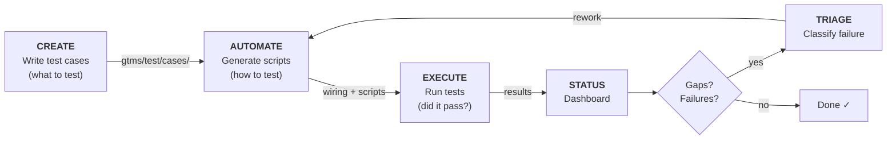
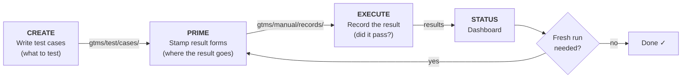

# GTMS User Guide

**Track your testing the way git tracks your code.**

GTMS conducts the test management lifecycle. You bring the test framework, the tools, or an AI coding agent; GTMS coordinates the create, prime, automate, and execute steps, owns the artefacts on disk, and records what happened.

## Overview

### Why GTMS?

**Testing with AI coding agents is fast but chaotic.** Your agent can generate hundreds of automated tests in minutes, but how do you know what's covered? How do you know which tests are working and which need repairing? When a test fails, was it a broken test, an automation script that's gone stale, or an actual bug? Without structure, AI-generated tests become a nightmare to manage.

GTMS solves this by putting test management into git alongside your code. Every test case, wiring record, and execution result is a plain text file tracked in version control. You get visibility of what's tested, what's working, and what's broken:

```
$ gtms status login

Scope: gtms/test/cases/login/ (use -r for recursive)

TEST CASE                         CREATE  AUTOMATE  EXECUTE  LAST RESULT
--------------------------------  ------  --------  -------  -----------------
tc-a3f72b10  valid-login          ✓       ✓         ✓        pass [playwright]
tc-b2c3d4e5  remember-me          ✓       ✓         ✓        pass [bats]
tc-c5d6e7f8  invalid-password     ✓       ✓         ✓        pass [playwright]
tc-d8e9f0a1  account-lockout      ✓       ✓         ✓        fail [playwright]
tc-f6a7b8c9  password-reset-link  ✓       —         —        —

Key:
  ✓ = complete  ✗ = error  ⚠ = stale  ⊘ = skipped
  ● = in progress    ○ = pending  — = not yet attempted
```

(Real output also appends a dim `Next:` hint naming the next command to run.)

**What GTMS gives you:**

- **Visibility** -- `gtms status` shows your entire test landscape at a glance: what's created, what's automated, what's passing, what's failing
- **Traceability** -- every test case can trace back to a requirement; every automation script traces back to a test case; `gtms map` shows the connections
- **Coverage gap analysis** -- `gtms gaps` tells you what's missing: unautomated test cases, currently failing tests, execution errors, and stale wiring (the test case or script changed since it was linked)
- **Framework independence** -- the same test case can be automated for Playwright, BATS, Pester, or any other framework; GTMS doesn't lock you in
- **AI-ready** -- point an AI agent at a requirement and get structured test cases in seconds, then automate them across any framework you already use; swap AI tools without losing your pipeline state
- **Scale** -- one tester orchestrating what used to take an army; the pipeline handles the bookkeeping so you can focus on testing

### The Automate Pipeline

**Use this when your AI agent is configured to write and execute your automated tests**

GTMS moves test cases through three stages:



1. **CREATE** -- Generate test cases from requirements, user stories, bug reports, or Jira tickets. Test cases are natural-language markdown files that describe *what* needs to be tested -- preconditions, test steps, and expected outcomes. They're human-readable, AI-readable, and framework-agnostic. This is the cornerstone artifact: a clear description of intent that all automation is built from.

2. **AUTOMATE** -- Turn test cases into executable scripts. The adapter reads a test case and produces a script for your chosen framework (Playwright, BATS, Pester, etc.). Because the test case describes *what* and the automation script describes *how*, you can automate the same test case for multiple frameworks -- and always check that your automated tests maintain the intent of the original test case.

3. **EXECUTE** -- Run the automated scripts and record the results. Pass or fail, the result is tracked in the pipeline and visible in `gtms status`. For tests that can't be automated, record manual results through the prime pipeline (`gtms prime tc-xxxxxxxx --framework manual` then `gtms execute tc-xxxxxxxx --adapter manual-execute`).

Each stage is independent. You can create test cases without automating them, automate without executing, or record manual results without any automation at all. The pipeline nudges you forward but doesn't force a path.

### The Prime Pipeline

**Use this when you (or an AI agent working in your console) run the test yourself and record the result -- manual testing, exploratory checks, or agent-driven verification**

GTMS moves test cases through three stages:



1. **CREATE** -- The same stage the automate pipeline starts with; the two pipelines share their test cases. A test case created here can be primed today and automated later.

2. **PRIME** -- Stamp a result template for the test case. GTMS writes `gtms/manual/records/<tc-id>--manual.result.yaml` with the identifying fields and a snapshot of the test case filled in, and the `result:` field left empty. Then you (or the agent in your console) run the test and record the outcome: `result: pass`, `result: fail`, or `result: skip`, plus any free-form notes.

3. **EXECUTE** -- Read back the filled result file, validate it, and lock in the result. From here it shows up in `gtms status` and `gtms gaps` side by side with automated results.

The prime pipeline produces no test script and no wiring record -- each pass through it records a one-time result. Re-priming stamps a fresh form (with `--force`) and re-executing records a fresh result. When you want a repeatable run instead, switch the test case to the automate pipeline; the two are siblings, not stages.

### Key terms

| Term | What it is |
|------|------------|
| **Test case** | A markdown file describing *what* to test: preconditions, steps, expected outcomes. Lives in `gtms/test/cases/`. Framework-agnostic -- it describes intent, not implementation. |
| **Artefact** (automation script) | An executable test script (e.g. a `.spec.ts` for Playwright, a `.bats` file for BATS). Generated by an adapter from a test case. "Artefact" is the contract term GTMS uses for it -- `gtms status` reports on it and the wiring record's `artefact:` field records its exact path. Lives wherever your framework expects it (`test/acceptance/` for BATS, `gtms/scripts/playwright/` for Playwright, or the adapter's configured `output-dir`). |
| **Wiring record** | A YAML file linking a test case to its automation script: `gtms/automation/wiring/<tc-id>--<framework>.wiring.yaml`. Names the script, the adapter that runs it, and the test case and script hashes GTMS uses to detect drift. Written by `gtms automate` and `gtms link`; read by `gtms execute`. |
| **Adapter** | A config entry (or script) that tells GTMS how to call an external tool. Each pipeline command delegates to an adapter. |
| **Framework** | A label identifying the test framework (e.g. `playwright`, `bats`). Values are lowercase identifiers -- letters, digits, and hyphens, starting with a letter or digit (`playwright`, `bats`, `pester`, `manual-v2`); GTMS rejects anything else because the label flows into filenames and directory paths. Every command that takes `--framework` applies this rule. Controls how wiring records are named and looked up. One test case can have automation for multiple frameworks. |
| **Pipeline** | The `create` -> `automate` -> `execute` flow that carries a test case from intent to a run result. `prime` is the sibling path for recording a one-time result you produce yourself. |
| **Mode** | One of GTMS's three operating patterns: Mode 1 (Manual CLI -- you run the commands), Mode 2 (Adapter-orchestrated CLI -- a configured adapter does the work), Mode 3 (Inline agent use -- an AI agent drives `gtms`). See "The three modes". |
| **Tier** | How GTMS invokes an adapter: Tier 0 built-in (GTMS runs its own code), Tier 1 command (a command string in `gtms.config`), Tier 2 script (a script file in `gtms.config`). An invocation detail -- it does not change what a command means. |
| **Result** | The test outcome -- what the test said: `pass`, `fail`, `skip`, or `error`. |
| **Status** | How far the adapter got -- the execution state: `pending`, `in-progress`, `complete`, or `error`. Status and result are separate axes: status tracks the adapter's execution, result tracks the test outcome. A test case can be `complete` (status) with a `fail` (result) -- that is not a contradiction. |
| **Prompt template** | A markdown file with `{variable}` placeholders that GTMS fills in before passing to an AI adapter. Used by `create` and `automate` to give the AI its instructions. |
| **Guide** | A markdown file containing your test case writing standards. Lives in `gtms/test/guides/`. GTMS embeds guides into every AI adapter's prompt automatically, so the AI follows your conventions. |


**What's an adapter?** An adapter is a small config entry (or script) that tells GTMS how to call your tools. If you use Playwright to run tests, the adapter says "run `npx playwright test`". If you use Claude Code to write test cases, the adapter says "use this template with this prompt to write an automation script to cover this test case". GTMS handles everything else -- creating task files, tracking results, building the dashboard. You can start without any adapter configuration (GTMS creates skeleton test case files for manual testing by default) and add adapters as your workflow matures.

**What's a framework?** A framework is the label GTMS uses for the kind of test artefact -- `playwright`, `bats`, `pester`, or the `manual` label the prime pipeline uses. The label follows the artefact through the pipeline: it names the wiring record (`<tc-id>--<framework>.wiring.yaml`), tags the result you see in `gtms status` (`pass [playwright]`), and lets one test case carry automation for several frameworks side by side. GTMS itself never runs a framework -- the adapter does that; the framework is how GTMS files and finds what the adapter produced.

### Framework vs Adapter -- a quick analogy

A helpful way to keep these two straight:

- **Framework = the destination.** It's *what* the tests are once they exist -- Playwright specs, Pester scripts, BATS files. The artefact type.
- **Adapter = the path to the destination.** It's *how* you get there. One adapter might use Claude Code to produce Playwright tests; a different adapter might use Codex to produce the same Playwright tests. Different paths, same destination.

Two footnotes to the analogy:

- Framework applies from `automate` onward and is carried through to `execute`; `prime` uses it too (defaulting to the `manual` label). A `create` adapter produces test case specs, which are framework-agnostic -- there's no destination framework to pick yet.
- Some adapters are framework-agnostic (you pass `--framework playwright` or `--framework pester` and the same adapter handles both); others are locked to a single framework (e.g. a BATS runner that only knows how to execute BATS). The path sometimes constrains which destinations are reachable.

## The three modes

GTMS supports three modes of use. They share the same commands and the same on-disk artefacts. The difference is who fills in the files and which adapter does the work.

**What's an adapter?** An adapter is a small config entry (or script) that tells GTMS how to call your tools. If you use Playwright to run tests, the adapter says "run `npx playwright test`". If you use Claude Code to write test cases, the adapter says "use this template with this prompt to write an automation script to cover this test case". GTMS handles everything else -- creating task files, tracking results, building the dashboard. You can start without any adapter configuration (GTMS creates skeleton test case files for manual testing by default) and add adapters as your workflow matures.


With this adapter concept in mind GTMS has three modes of operation that use adapters to coordinate your testing in different ways.


- **Mode 1: Manual CLI.** A human tester runs the commands and fills in the files. No AI in the loop. GTMS uses built-in adapters to stamp and track your testing files.

- **Mode 2: Adapter-orchestrated CLI.** GTMS calls adapters that you configure in `gtms.config`. A configured adapter can drive a framework runner, call a remote service, shell out to a custom script, or invoke an AI tool that you have set up yourself. This is the mode for CI, headless runs, and team-specific orchestration.

- **Mode 3: Inline agent use.** An AI coding agent that is already operating in your repo runs `gtms` directly, fills the files GTMS stamps, and records results through built-in `agent-*` adapters.

All three modes use the same core commands: `gtms create`, `gtms prime`, `gtms automate`, `gtms execute`, and `gtms status`. 

## Two paths after create

`gtms create` stamps a test case skeleton. After that, the choice is which of two paths to take next.

- **Prime path.** Use `gtms prime` to stamp a result template. You or an AI agent exercise the feature directly and fill the template with `result: pass`, `result: fail`, or `result: skip`. You then run `gtms execute` to lock in the test result. Useful when you are recording a result from direct testing.

- **Automate path.** Use `gtms automate` to create a test script and a wiring record. The test script will be your typical automation script (e.g. a Playwright script). You or an AI agent writes the script, then you use `gtms execute` to run it. Useful when you want a repeatable test that lives in the repo.

The two paths are siblings, not stages. The same test case can be primed now and automated later.

## Install and verify

Install GTMS through one of the shipped channels:

- From source with Go:

```sh
go install github.com/aitestmanagement/gtms-cli/cmd/gtms@latest
```

- Or download a release binary from the project's GitHub Releases page and put it on your path.

After installation, confirm the binary is available:

```sh
gtms version
```

Run GTMS commands from inside a git-initialised project. `gtms init` will warn if you are not at the git root.

## Initialise the project

From your project root, scaffold the GTMS layout:

```sh
gtms init
```

`gtms init` accepts `--preset <name>` to pick a workflow preset (`manual`, `bats`, or `playwright`). Plain `gtms init` in an empty repository scaffolds the `manual` default preset; in an already-initialised project it lists the available presets and exits. Use `--presets` to list the presets without scaffolding. The preset selector on `init` controls which scaffold files get copied into your repo; it is distinct from the `--adapter` flag on the action commands, which selects the adapter to run at the time of invocation.

Setup is mode-agnostic. Scaffolding the project does not commit you to Mode 1, Mode 2, or Mode 3. You choose your mode at the point you run an action command.

## Choosing a mode

You do not have to pick once and stick with it. A project can use more than one mode.

- If an AI coding agent is already running in your repo and will issue the commands, follow Mode 3 below.
- If you are testing by hand and want to record results yourself, follow Mode 1.
- If you want GTMS to dispatch a configured adapter (a CI runner, a custom script, a remote service, a team AI tool), follow Mode 2.

The guide walks the Mode 1 prime path next because it is the shortest end-to-end demonstration of the create, prime, execute, status flow.


## Your first walkthrough: Mode 1 prime path - Command Line Manual testing with GTMS

Three commands to get started. That's all it takes.

```bash
gtms init
gtms create my-feature 
gtms status
```

**What this does:**

1. `gtms init` created the nested pipeline directory at `gtms/` (with `test/cases/`, `automation/`, `execution/`, `tasks/`, and a `.gtms-root` sentinel file inside it) plus a `gtms.config` file at the repo root. Your git managed project is now GTMS-enabled -- the GTMS-owned footprint at your repo root is `gtms/`, `gtms.config`, and `.gtms/` (the last gitignored), plus a `.vscode/` folder for editor support and a few `.gitignore` entries GTMS manages for you.

2. `gtms create` generated a test case skeleton file in `gtms/test/cases/my-feature/`. The skeleton adapter writes a markdown file with YAML frontmatter (`test_case_id`, `title`, `requirement` (filled when `--reference` is passed), `priority`, `type`, and `created`) followed by a seven-section body -- Test Objective, Preconditions, Test Data, Test Steps, Expected Final Outcome, Postconditions, Notes -- using "Expected observation:" wording for each step. You fill in the details yourself. (Configure an AI adapter later and GTMS will generate the content for you.) The accompanying authoring reference lives at `gtms/test/guides/gtms-test-case-authoring-guide.md`.

By default, `gtms init` configures `gtms create` to use the built-in `manual-create` adapter -- it runs as Go code inside the GTMS binary and stamps from the template at `gtms/test/templates/manual-testcase.template.md`. Edit that template to customise the test case shape. A script-tier alternative ships alongside at `gtms/adapters/manual-create-script.sh` as an opt-in customisation surface for adapter behaviour. On Windows, adapter scripts run through Git Bash (which provides `sh`).

3. `gtms status` showed your testing landscape -- test cases exist, nothing automated yet, nothing executed yet. The gaps are visible, like `git status` showing untracked files.

No framework needed, no adapter config needed, no AI setup needed. You're tracking your testing from the first command. The dashboard nudges you forward. Automate what you can, execute what you've automated, triage what fails.

After each command, GTMS shows guidance hints suggesting what to do next. These hints are especially helpful when you're learning the workflow. You can disable them later with `gtms init --guidance-off`.

### Recording your first result

The create step stamped an empty test case; the prime path is how you record a result against it. The create output names the new test case's `tc-XXXXXXXX` ID (it is also the filename prefix under `gtms/test/cases/my-feature/`). Three more commands complete the loop:

```bash
gtms prime tc-xxxxxxxx
# run the test yourself and record the outcome in the stamped file, then:
gtms execute tc-xxxxxxxx
gtms status tc-xxxxxxxx
```

**What this does:**

1. `gtms prime` stamps a result template at `gtms/manual/records/tc-xxxxxxxx--manual.result.yaml`. GTMS fills in the identifying fields and a snapshot of the test case; the `result:` field is left empty for you.

2. You run the test yourself -- by hand, against whatever you are testing -- then record the outcome in the stamped file as `result: pass`, `result: fail`, or `result: skip`, plus any free-form notes. If you edit in VSCode, the scaffolded schema mapping and snippets fill in the boilerplate (see "VSCode editor support" in the Mode 1 section).

3. `gtms execute` reads the filled file, validates it, and records the result in the pipeline.

4. `gtms status tc-xxxxxxxx` shows the recorded result; bare `gtms status` rolls it into the folder summary.

Every command runs bare because the manual preset scaffolded the `manual-*` adapters as the defaults. GTMS stamps the files; you fill them in -- that is the whole Mode 1 contract. For the full Mode 1 walkthrough, including the automate path, see the Mode 1 section.

### The demo

If you want to see the full pipeline in action with pre-configured adapters and sample data:

```bash
gtms init --demo
```

This seeds a sample requirement, demo adapters, and step-by-step guidance. Follow the printed hints to run the full create -> automate -> execute pipeline against the sample; the dashboard fills in as you go.


## Your Second Walkthrough: Mode 2 automate path - AI CLI/API with GTMS Command Line

In Mode 2 you configure an AI CLI (a `claude` or `gemini` command line, or any tool you can invoke from a shell) as an adapter in `gtms.config`, and GTMS calls it for you. Where Mode 3's inline agent runs `gtms` itself, Mode 2 reverses the direction: you run `gtms`, and GTMS dispatches the AI.

With an AI adapter registered for `create` and `automate` and a framework runner for `execute` (the Mode 2 section shows the exact `gtms.config` for this setup), the whole automate path is four commands:

```sh
gtms create <folder> <name>
gtms automate <tc-id> --framework bats
gtms execute <tc-id>
gtms status <tc-id>
```

Create dispatches the AI adapter, which writes the test case content -- GTMS allocates the `tc-XXXXXXXX` ID and validates what comes back. Automate dispatches the AI again to produce a BATS script, and GTMS writes a wiring record linking the script to the test case. Execute runs bare: the wiring record names the framework runner (`bats-runner` here), so GTMS runs the script and records the outcome. Status shows the result.

No flags name an adapter anywhere -- `defaults.create` and `defaults.automate` point at your AI adapter, and the wiring record routes execute. That hands-off quality is why Mode 2 is the mode for CI and scripted runs. You control what the AI is told through your prompt template and the guides folder (see Templates and Guides).

For the configuration shape, resolver precedence, and the adapter contract, continue to the Mode 2 section.

## Your Third Walkthrough: Mode 3 prime path - AI Client Terminal Calling GTMS

You create a test case then the prime path stamps a test result record. Use it when an inline agent can exercise the feature directly and report the results.

Create the test case. GTMS stamps an empty skeleton with an allocated `tc-XXXXXXXX` identifier. The agent fills in the spec.

```sh
gtms create <folder> <name> --adapter agent-create
```

Prime a result template. GTMS writes the template to `gtms/manual/records/<tc-id>--manual.result.yaml`. The agent exercises the feature and records `result: pass`, `result: fail`, or `result: skip` in the template.

```sh
gtms prime <tc-id> --adapter agent-prime
```

Execute. GTMS reads the filled result template and formally records the test result. The result will then start showing up in test reports and status reports.

```sh
gtms execute <tc-id> --adapter agent-execute
```

Check the result.

```sh
gtms status <tc-id>
```

For the full Mode 3 walkthrough, including the automate path and the relationship between `agent-*` and `manual-*` adapter names, continue to the Mode 3 section.


## Guide Structure

- **Mode 3: Inline Agent Use.** Both Mode 3 paths in full, plus the adapter naming explanation.
- **Mode 2: Adapter-Orchestrated CLI.** Configured adapters, resolver precedence, and where to read more in `reference/adapter-guide.md`.
- **Mode 1: Manual CLI.** The same lifecycle without AI in the loop.
- **Visibility: Status, Gaps, Map.** Reading the dashboard and the coverage view.
- **Files And Configuration.** On-disk layout, file formats, and the `gtms.config` shape.
- **Templates and Guides.** Editing the shape of stamped artefacts, switching to script adapters, and teaching AI adapters your conventions.
- **Command Reference.** Per-command summary for the first-release surface.
- **Troubleshooting.** Recovery patterns when the dashboard surprises you.
- **Appendix: Where To Go Next.** Pointers to deeper documents.


The modes are ordered top-down by layer rather than numerically. Mode 3 leads because most readers actually arrive there already (inside an AI agent like Claude Code). Mode 2 is the layer beneath: the CLI invoking AI through configured adapters -- the most advanced of the three and, once configured, the most hands-off (ideal for CI, fleets, and scripted runs). Mode 1 is the foundation, CLI only with no AI in the loop.

## Mode 3: Inline Agent Use

Mode 3 is the path where an AI coding agent already operating in your repo runs `gtms` directly and fills the files GTMS stamps. This section walks both Mode 3 paths in turn -- the prime path first, then the automate path.

### What "inline" means

Mode 3 assumes that an AI coding agent is already present and operating in the same codebase you're working in. Unlike Mode 2, GTMS does not call the agent -- the agent calls GTMS. The agent runs `gtms create`, `gtms prime`, `gtms automate`, `gtms execute`, and `gtms status` itself, reads the files GTMS stamps, and fills them with the content GTMS expects.

The filesystem is the handoff. GTMS stamps skeletons; the agent fills them in; GTMS reads them back. Nothing else is shared between GTMS and the agent.

### Creating the test case

The first step in both the "prime" and "automate" paths is the agent executing the `gtms create` command. This stamps a markdown test case file with a unique test case ID.

GTMS owns the identifier and the skeleton file. It generates a `tc-XXXXXXXX` ID, writes it into both the spec's filename and its YAML frontmatter, and stamps an empty skeleton under `<folder>` for the agent to fill. The agent must not generate or rename the ID.

The agent then fills in the spec body -- title, requirement reference, type, priority, preconditions, steps, expected results, and any other fields the project's spec template asks for. Filling the spec is content work, not GTMS work: GTMS hands the agent an envelope, the agent writes inside it.

Downstream commands (`prime`, `automate`, `execute`) re-validate the file and reject frontmatter / filename ID mismatches, missing required frontmatter, or duplicate IDs in the same folder. The gate runs on single-test-case invocations; bulk automate and execute runs skip it.

Both Mode 3 paths -- prime and automate -- start from this point. The next subsection covers the choice between them.

- **Prime path - create test cases WITHOUT test automation scripts** Where you want to run and record a test result from manual testing. Or where you want an AI agent to run a computer use scenario and then the agent records the test result. The agent exercises the feature, then fills in a result template with `result: pass`, `result: fail`, or `result: skip`. No reusable script is produced and no wiring record (linking a test case to a script) is created. Use this when you or an AI agent need to enter the test result (not when you need to capture the results of executing a deterministic repeatable script).
- **Automate path - create test cases WITH test automation scripts** Produce a reusable test script and a wiring record so the test can be rerun. In this scenario GTMS will be used to create both the test case file (which the agent then fills in) and the automation script file (which the agent then fills in too). GTMS will also create the wiring file that links the test case to the script. Use this when you have an automated script that runs deterministically and produces a test result.

A single test case can take both paths over its lifetime. Prime it now to capture a test result without a script, then automate it later when the behaviour stabilises and you write a script.

This section walks the prime path. For the automate path, see "Automate path" below.

### `agent-*` and `manual-*` adapter names

Each Mode 3 action command has a built-in adapter under an `agent-*` name: `agent-create`, `agent-prime`, `agent-automate`, and `agent-execute`. Each also has a matching `manual-*` name used by Mode 1: `manual-create`, `manual-prime`, `manual-automate`, and `manual-execute`.

Both names in a pair route to the same implementation today, but for create and prime each adapter reads its own template file (day-one content is identical; edit one and the paths diverge). They are not aliases. The two-name surface is intentional so the two names can be wired to different behaviour later without breaking either intent. Use the `agent-*` name when an AI agent is operating the command; use the `manual-*` name when a human is running `gtms.exe` from the command line. 

An AI agent using Mode 3 should use the explicit `--adapter agent-*` flags (e.g. `--adapter agent-create`). There is no automatic defaulting to `agent-*` based on which agent is active; the agent should declare its adapter intent by using the flag. One exception: on the automate path, run `gtms execute` bare -- `--adapter agent-execute` selects the prime path and reads the primed result file instead of running the wired script.

### Prime path

The prime path lets you record a test result. It is the shortest path from a fresh test case to a recorded result. The prime path usually consists of the following sequence of commands.

```sh
gtms create
gtms prime
gtms execute
gtms status
```

The following sections cover each of these commands in more detail.


#### Step 1: Create the test case

```sh
gtms create <folder> <name> --adapter agent-create
```

GTMS stamps an empty test case skeleton file under `<folder>` and allocates a `tc-XXXXXXXX` identifier. The agent does not generate the ID; GTMS owns it and writes it into the test case's frontmatter and filename.

The agent then fills the test case body: title, requirement reference, type, priority, preconditions, steps, expected results, and any other fields the project's test case template asks for. Once the agent has written the test case, downstream commands re-validate the file. Frontmatter / filename ID mismatches, missing required frontmatter, and duplicate IDs in the same folder are caught at the entry to `prime` and `execute` commands.

#### Step 2: Prime a result template

```sh
gtms prime <tc-id> --adapter agent-prime
```

GTMS stamps a result template at `gtms/manual/records/<tc-id>--manual.result.yaml`. The template is the recording envelope: it carries identifying fields (including the `test_case_hash` GTMS uses to detect drift at execute time), a snapshot of the test case, and an empty `result:` field for the agent to fill.

The agent now exercises the feature directly, independently of GTMS. In Mode 3 this usually means doing the same thing a tester would do, with the agent's own tools: navigating to a page, sending a request, running a script, reading state, comparing outputs. The agent uses whatever it can drive in the current session, then decides what the test result should be.

After exercising the feature, the agent records the outcome in the result template:

```yaml
result: pass
```

or `result: fail`, or `result: skip`. The agent may also fill any free-form notes the template provides, but `result:` is the field that ties the test result to the pipeline.

#### Step 3: Execute

```sh
gtms execute <tc-id> --adapter agent-execute
```

`agent-execute` reads the filled result template, validates it, and records the result. It bypasses the wiring lookup that the automate path depends on. The explicit flag matters on projects whose default execute adapter is not a prime-path adapter (the bats and playwright presets); under the manual preset, `defaults.execute: manual-execute` means bare `gtms execute <tc-id>` records from the primed file too. On the automate path, bare `gtms execute <tc-id>` lets the wiring record name the adapter.

The execute step is where the test result becomes durable. A handoff result is written to `.gtms/results/*.handoff.yaml` (gitignored local state) and the visible result moves into the pipeline.

#### Step 4: Check the result

```sh
gtms status <tc-id>
```

`gtms status <tc-id>` shows the recorded test result for the test case; bare `gtms status` rolls it into the folder summary alongside every other test case in the project pipeline.

### What the prime path does not produce

The prime path does not write a reusable test script. It does not write a wiring record (a wiring record links the test case to the automated script). If you re-prime (with `--force` -- prime refuses to overwrite an existing result file) and re-execute the same test case, you are recording a fresh test result (not replaying an automated run).

This is intentional. The prime path is for the situations where YOU or an AI agent need to enter the test result. For example, exploratory feature checks, ad-hoc verification, agent-driven sanity passes, anything where you want a result recorded but do not yet have or want a repeatable script.

### When to switch to the automate path

When the situation shifts from AI/human entering the result to automated script, switch from prime to automate. Use the automate path when you want the test to be re-runnable in CI, by another agent, or by a human running the script directly. The next subsection, "Automate path", walks the same lifecycle with `gtms automate` in place of `gtms prime`. It introduces the wiring record, the framework constraint, and the bare `gtms execute <tc-id>` form that the wiring path enables.

### Automate path

The automate path is the other side of the post-create fork. Where the prime path records a one-time test result from a test case you run, the automate path produces something the team can replay: a reusable test script and a wiring record that ties the test case to it.

Use the automate path when the value of the test is its repeatability. The agent still writes the test case content, but also creates a script that can be re-run by another agent, a human, or CI, against future builds.

#### Prime versus automate, in one line

*The Prime path expects someone (you or an AI agent) to be recording the test result. The Automate path creates a test result from running a repeatable script.*

Both paths start with the same `gtms create` step and both end with `gtms execute` and `gtms status`. The difference is the middle step. Prime stamps a result template that the agent fills with `result: pass | fail | skip`. Automate stamps a test script and a wiring record; the agent fills the script.

A single test case can take both paths over its lifetime. The fork is a choice about what you want next, not a permanent path for the test case.

#### What automate produces

`gtms automate` produces two artefacts:

- **A reusable test script** for the framework you ask for. The script is a skeleton at first; the agent fills in the script's code. By default the built-in automate adapters stamp it in the framework-native directory -- `test/acceptance/` for BATS, `gtms/scripts/playwright/` for Playwright. Set `output-dir` on the automate adapter to redirect it (for example, into an existing framework harness so the framework discovers the spec where it already looks); the wiring record's `artefact:` path follows wherever it lands, so `gtms execute` still finds it.
- **A wiring record** that links the test case to the script and to the adapter that should run it. The wiring record is what makes `gtms execute <tc-id>` work later without you having to name the adapter again.

The wiring record is the reason the automate path can run bare `gtms execute <tc-id>`: the wiring record names the adapter. The prime path has no wiring record to consult -- it relies on the execute adapter being a prime-path one, either named explicitly (`--adapter agent-execute`) or set as the project default (the manual preset ships `defaults.execute: manual-execute`).

#### Framework choice and the BATS dogfood example

Built-in `agent-automate` ships skeleton support for BATS and Playwright in the first release. Other frameworks (Cypress, Pester, etc.) are not shipped as built-in worked examples; if you ask `agent-automate` for them, it rejects the request with a diagnostic. Configured Mode 2 adapters can target other frameworks, but that is a Mode 2 story; this section stays inside the built-in path.

The worked example below uses BATS. BATS is shown because the GTMS project uses BATS for its own CLI acceptance tests, so this is the verified dogfood path. BATS is not the default user framework. The framing of every step is otherwise framework-neutral; only the concrete command line names BATS.

To target a framework beyond the shipped BATS and Playwright templates through the built-in automate path, copy whichever is closer and adapt it -- both are meant to be readable as worked examples. Edit it for your framework, then wire it through a configured automate adapter (Mode 2). The user-facing recipe for editing templates and guides is covered in the "Templates and Guides" section later in this document.

#### Worked flow

The automate-path worked flow starts from `gtms create` so you can read this subsection on its own. It mirrors the shape of the prime-path walkthrough, with `gtms automate` in the middle step instead of `gtms prime`.

The automate path usually consists of the following sequence of commands.

```sh
gtms create
gtms automate
gtms execute
gtms status
```

The following sections cover each of these commands in more detail.

##### Step 1: Create the test case

```sh
gtms create <folder> <name> --adapter agent-create
```

GTMS stamps an empty test case skeleton under `<folder>` and allocates a `tc-XXXXXXXX` identifier. The agent then fills the test case body (title, requirement reference, type, priority, preconditions, steps, expected results). Frontmatter / filename ID mismatches, missing required frontmatter, and duplicate IDs in the same folder are caught at the entry to `automate` and `execute`.

##### Step 2: Automate the test case

```sh
gtms automate <tc-id>
```

On a `bats`-preset project this bare form is all you need -- the preset already points `automate` at `agent-automate` with `framework: bats`. The explicit form (`gtms automate <tc-id> --framework bats --adapter agent-automate`) selects the same route by hand; reach for `--framework` or `--adapter` only to override the preset default for one run.

`agent-automate` stamps two things in one step:

- A BATS test script skeleton in the framework's output directory -- `test/acceptance/<folder>/` for BATS, `gtms/scripts/playwright/<folder>/` for Playwright -- unless the automate adapter's `output-dir` setting redirects it.
- A wiring record that points at the new script and records the execute adapter future runs should use. GTMS resolves that adapter from the execute side of `gtms.config` (the execute adapter declaring the same framework); if no execute adapter is configured for the framework, automate refuses to stamp anything. The wiring record is created with `artefact-hash: pending` and stays pending until the first `gtms execute`.

The agent now fills the BATS script. In Mode 3 the agent reads the test case spec it filled in Step 1, translates the steps into BATS, and writes the assertions. Filling the script is AI coding work, not GTMS work; GTMS does not enforce a particular structure on the script body. You will get better results if you can point your coding agent at examples, patterns, framework structures, etc.

##### Step 3: Execute

```sh
gtms execute <tc-id>
```

This is the deliberately bare form. There is no `--adapter` flag because the wiring record from Step 2 already names the adapter. The execute command reads the wiring record, resolves the adapter, and runs the test.

The first execute is also where the wiring record's `artefact-hash: pending` placeholder is replaced. On first execute, GTMS computes the real hash of the script the agent just wrote and stores it in the wiring record. Subsequent executes compare the script against that hash to detect drift.

The pending bootstrap is not optional. Even `--allow-stale`, which normally lets execute proceed past a stale wiring record, does not bypass the pending bootstrap. A wiring record is only useful once it has a real hash to drift against, so the first run always settles it.

##### Step 4: Check the result

```sh
gtms status <tc-id>
```

`gtms status <tc-id>` shows the recorded result for the test case. The wiring record is now fully established; further executes will run the same script and either pass, fail, or report drift if the script has changed without going through `gtms automate` or `gtms link` again.

#### Pending wiring in plain terms

The wiring record stores a hash of the test script so GTMS can detect drift -- if the script on disk no longer matches the hash recorded at the last run, the wiring record is stale and the next run cannot be trusted as a like-for-like comparison. But `gtms automate` writes the wiring record before the agent has filled in the script, so there is no real script content to hash yet. `pending` is the explicit "not settled" marker for that gap. The first `gtms execute` computes the real hash and writes it into the wiring record; from that point on, drift checking applies normally.

Pending wiring is the state of a freshly-stamped automate record between the moment `gtms automate` writes it and the moment the first `gtms execute` settles it. While the wiring record is pending:

- The wiring record carries `artefact-hash: pending` in its on-disk YAML.
- `gtms status`, `gtms gaps`, and `gtms map` treat the test case as wired, not as stale or missing. The pending state is normal, not an error.
- The first `gtms execute` bootstraps the pending hash into a real hash before drift checking begins.
- `--allow-stale` does not bypass that bootstrap.

The pending state also shows up in the JSON surfaces: each wired `frameworks[]` entry in `gtms status --json` (and the detail and map JSON) carries `wiring_bootstrap: pending | ready`, so scripts can key on it. (The synthesized `manual` entry has no wiring and leaves the field empty.)

#### When you might need `gtms link`

`gtms link` exists as a wiring-write utility for situations where you already have a script and a test case that need to be tied together outside the normal `gtms automate` flow. It is not part of the default Mode 3 automate path. The automate path produces a wiring record automatically as the automation script is created; reach for `gtms link` only when you need to write or repair a wiring record by hand. The Visibility and Command Reference section documents `gtms link` in full.

#### Switching between paths

Choosing automate over prime for one test case does not commit the project to automate-only. You can prime a test case to record a test result you've decided on, or come back to a primed test case later and automate it. The relationship between prime and automate is a per-test-case choice about what you want next, not a project-wide mode setting.

**Can a single test case have both a primed result template and a wiring record at the same time?** On disk, yes -- neither `gtms prime` nor `gtms automate` rejects the other's artefact. `gtms status` treats the wiring record as the authoritative path: the wired framework's result is what the headline row shows. Bare `gtms execute <tc-id>` runs the wired script provided the project's execute default is a runner adapter (as in the bats and playwright presets); if `defaults.execute` names one of the prime-path execute adapters (as in the manual preset), the bare form takes the prime path and ignores wiring.

To force the prime path even when a wiring record exists, pass the explicit Mode 3 execute adapter:

```sh
gtms execute <tc-id> --adapter agent-execute
```

This is the same form the prime-path Step 3 uses; it bypasses wiring lookup and reads the primed result template directly. `--framework` does not cross paths -- it only disambiguates between multiple wiring records on the automate side.

Practically, the typical lifecycle for a test case that takes both paths is sequential, not parallel:

1. Prime and execute the test case to record an early result while the behaviour is still being shaped.
2. Once the behaviour stabilises, run `gtms automate` to stamp the test script and wiring record.
3. From that point on, the bare `gtms execute <tc-id>` runs the wired script (subject to the preset caveat above). The earlier primed result stays on disk and remains visible -- `gtms status --json` lists it as a `manual` entry alongside the wired framework, and `gtms status <tc-id> --framework manual` selects it -- but the wired framework's result is what the headline row shows. Re-executing with `--adapter agent-execute` updates the manual record without changing that headline.

## Mode 2: Adapter-Orchestrated CLI

Mode 2 is the path where GTMS uses adapters that you configure in `gtms.config` rather than the built-in `agent-*` or `manual-*` adapters. The CLI surface is the same; the difference is that `--adapter` points at a name you have defined, and that adapter does the work.

Mode 2 is the right shape for CI runs, headless pipelines, remote orchestration, team-specific scripts, and integrations with framework runners or AI tools that you set up yourself. This section is a short orientation. Adapter depth (tiers, contracts, prompt templates, guide directories, env-var contracts) lives in `reference/adapter-guide.md`.

### What a configured adapter is

A configured adapter has an entry in `gtms.config` under one of the action-command buckets (`create`, `automate`, `prime`, `execute`). The entry gives the adapter a name and describes how GTMS should invoke it: either as a command line GTMS shells out to, or as a script GTMS executes with a defined contract of environment variables and output files.

A cut-down example showing one of each shape:

```yaml
adapters:
  create:
    local-claude:                  # Tier 1: command-line adapter
      mode: sync
      command: 'claude -p "..." --append-system-prompt-file {prompt_file} --allowedTools ""'
  execute:
    bats-runner:                   # Tier 2: script adapter
      mode: sync
      script: gtms/adapters/bats-runner.sh
      framework: bats

defaults:
  create: local-claude             # no --adapter flag needed on create
```

The `adapters:` block is keyed by command bucket, then by adapter name; each entry carries at most one of `command:` (Tier 1), `script:` (Tier 2), or `module:` (Tier 3, future). An entry with none of these attaches configuration (for example a `framework:`) to a Tier 0 built-in -- the shipped presets use this shape. The `defaults:` block lets you register one configured adapter as the no-flag default for a command. The same shape extends to `automate` and `prime` buckets.

"Tier" here is GTMS shorthand for how the adapter plugs in: **Tier 0** is built-in Go code in the binary, **Tier 1** is a `command:` line GTMS shells out to, **Tier 2** is a `script:` GTMS executes via an env-var / result-file contract. Full tier semantics live in `reference/adapter-guide.md`.

**In a Tier 1 `command:`, write placeholders bare -- do not put shell quotes around them.** GTMS escapes each value into one complete shell token before substituting it, so `{output_dir}` already arrives as a single argument even when the path contains spaces. Quote it yourself and those escaping quotes become literal characters inside the value: the tool writes to a path that does not exist, exits 0, and GTMS records a pass. Note that quoting the whole `command:` scalar is YAML syntax and is correct -- it is only shell quotes *around a placeholder* that break. GTMS prints a warning when it spots one, but does not block the run. Because a bare placeholder is always its own token, there is no Tier 1 way to interpolate a value into a multi-word argument; use a prompt template for prose, or a Tier 2 adapter for shell composition. `reference/adapter-guide.md` covers the rule and both routes. The Tier 1 example above follows it -- `{prompt_file}` is bare.

GTMS does not care what the adapter is on the other side. It can drive a framework runner, an in-house harness, a remote API, or a tool that wraps an AI agent you set up yourself. As long as the adapter honours the contract, GTMS reads the result back from the filesystem and treats it the same way it would treat any other run.

Every sync-adapter invocation is bounded: GTMS runs it with the adapter's configured `timeout:` if set, otherwise a 30-minute default, and never waits on an adapter indefinitely. If the bound fires, GTMS cancels the adapter and terminates the entire descendant process tree -- not just the immediate child -- so a wedged grandchild or leftover server process cannot strand the run. The containment mechanics live in `reference/adapter-guide.md`.

The adapter contract itself, the tiered ways of plugging in (command-line, script, future module), and the env-var / result-file shape are documented in `reference/adapter-guide.md`. This section names them but does not go into detail about how to create them.

If the configured adapter is an AI tool (e.g. a `claude` or `gemini` CLI wrapped in a Tier 1 `command:` entry), the prompt-template and `gtms/test/guides/` surface described in the "Templates and Guides" section of this document applies. The guides folder was built primarily for this case -- teaching a configured AI create adapter your project's conventions through embedded `.md` files.

### Resolver precedence

When you run an action command, GTMS picks the adapter to invoke through a fixed precedence:

1. The `--adapter <name>` flag on the command line, if present.
2. The `defaults.<command>` entry in `gtms.config`, if set for that command.
3. The built-in fallback, where one exists.

All four action commands ship Tier 0 built-ins (`manual-*`, `agent-*`) you can select via `--adapter` or `defaults.<command>`. Only `prime` has an implicit fallback at step 3 (`manual-prime`); the others error unless step 1 or step 2 picked one. `gtms init` scaffolds defaults for all four action commands (`defaults.create`, `defaults.prime`, `defaults.automate`, `defaults.execute`), so a freshly initialised project resolves every action command via step 2 without a flag.

Config-defined adapters with the same name as a built-in take precedence over the built-in. That means a project can give an adapter the name `agent-create` (or `manual-execute`, or any other built-in name) in its `gtms.config` and that configured adapter will be used instead of the shipped built-in. Unknown adapter names still error; the built-in adapter table is closed.

This precedence is the same regardless of mode. Mode 1, Mode 2, and Mode 3 all resolve adapters through the same rules, with one carve-out: on the wired execute path, the wiring record (not `defaults.execute`) names the adapter, and `--adapter` must agree with it. Mode 2 is just the case where the resolved adapter happens to be one you defined.

### A representative configured-adapter flow

A typical Mode 2 setup pairs a Tier 1 command adapter for `create` and `automate` (an AI CLI wrapped in one config line) with a framework runner for `execute`. The `gtms.config` for this scenario:

```yaml
adapters:
  create:
    local-claude:
      mode: sync
      command: 'claude -p "..." --append-system-prompt-file {prompt_file} --allowedTools ""'
  automate:
    local-claude:
      mode: sync
      command: 'claude -p "..." --append-system-prompt-file {prompt_file} --allowedTools ""'
  execute:
    bats-runner:
      mode: sync
      script: gtms/adapters/bats-runner.sh
      framework: bats

defaults:
  create: local-claude
  automate: local-claude
```

With that config in place, the flow is:

```sh
gtms create <folder> <name>
gtms automate <tc-id> --framework bats
gtms execute <tc-id>
gtms status
```

Three things to notice:

- `gtms create` and `gtms automate` need no `--adapter` flag because `defaults.create` and `defaults.automate` are set. Drop the defaults and you'd add `--adapter local-claude` on each.
- `gtms execute <tc-id>` is bare for a different reason: `gtms automate` wrote a wiring record naming the execute adapter (`bats-runner` here), and execute selects the adapter from the wiring record rather than from `defaults.execute` -- unless `defaults.execute` (or `--adapter`) names one of the prime-path execute adapters (`manual-execute` / `agent-execute` and their `-script` variants), in which case wiring is bypassed. In this example `defaults.execute` is unset, so the wiring alone is what makes bare execute work. Setting `defaults.execute` also acts as the tie-break automate uses when several execute adapters match a framework.
- `--framework bats` is a different axis from `--adapter`: `--adapter` picks *what runs*; `--framework` tells it *what to produce*. The automate adapter is `local-claude` (from `defaults.automate`); the `--framework bats` flag tells it to generate a BATS script. Configured automate adapters set their own framework support; `local-claude` is framework-agnostic. (The built-in `agent-automate` and `manual-automate` ship skeleton support for BATS and Playwright in the first release.)

In Mode 2, adapters are your way of customising what GTMS does when you run the `create`, `automate`, `prime`, and `execute` commands. Each command gets its own adapter (or its own default), and you can pick a different tool for each one -- an AI CLI for `create`, a shell command (Tier 1) for `automate`, a script runner for `execute`. GTMS handles the orchestration around them; the adapter does the work.

### Where Mode 2 fits next to Mode 3

Mode 2 and Mode 3 are not alternatives in the sense that you have to pick one. A project can use Mode 3 (inline `agent-*` adapters) where an agent writes test cases directly, and Mode 2 (configured adapters) for the same test cases when they run in CI. The on-disk artefacts, the wiring record, and the lifecycle are the same; what changes is the adapter that gets called at the moment a command runs.

The boundary worth keeping in mind: Mode 3 is the inline path used in an agent coding terminal/session. The agent is already working in the repo session, and the `agent-*` adapters are built-in. Mode 2 is the path you reach for when GTMS needs to dispatch something that is not built-in, whether that is your existing test framework, a remote runner, or an AI tool you have set up yourself.

### Where to read more

For adapter tiers, full configuration shapes, environment variables, result-contract details, prompt-template assembly, guide directories, framework notes, and deployment patterns, see `reference/adapter-guide.md`. The user guide is deliberately a short orientation for Mode 2; the adapter guide is where the contract lives.

For the visibility surface that Mode 2 runs feed, see the Visibility section (status, gaps, map) later in this guide; `gtms list` and `gtms link` are covered in the Command Reference.

## Mode 1: Manual CLI

Mode 1 is GTMS without an AI agent in the loop. A human tester runs the commands and fills in the files.

For example, when you run `gtms create`, GTMS stamps a correctly formatted test case from a template. That stamped test case is then ready for you, as the tester, to write up and complete. The same pattern holds at each step: GTMS produces the file, you fill it in.

After `gtms create` writes the test case spec, the lifecycle forks. Choose one of two paths:

- **Prime path.** Record the result of a one-time test execution you complete yourself. Good for exploratory checks and ad-hoc verification. The value is the recorded result, not a repeatable run.
- **Automate path.** Produce a reusable test script and a wiring record that ties the test case to it. Good when the value is the repeatability -- the test can be replayed by CI or by another tester against a future build.

A single test case can take both paths over its lifetime. The fork is a choice about what you want next, not a permanent label on the test case.

### The `manual-*` adapters

Mode 1 uses a set of built-in `manual-*` adapters, one per lifecycle step. Each has an `agent-*` counterpart used by the inline-agent workflow in Mode 3:

| Step | Mode 3 adapter | Mode 1 adapter |
|---|---|---|
| Create the test case | `agent-create` | `manual-create` |
| Prime a result template | `agent-prime` | `manual-prime` |
| Automate the test case | `agent-automate` | `manual-automate` |
| Execute (prime path) | `agent-execute` | `manual-execute` |

Today the two names in each pair route to the same implementation, but they are not aliases. The two-name surface exists so the pairs can be wired to different behaviour later without breaking either intent. If you are running commands by hand, always pick the `manual-*` name.

Each adapter reads a template file when it stamps its artefact. `manual-create` reads `gtms/test/templates/manual-testcase.template.md`; `manual-prime` reads `gtms/manual/templates/manual-result.template.yaml`. Edit these templates to change the shape of the files GTMS stamps -- for example, if your test cases need extra frontmatter fields, or your result records need an environment-notes section. See Templates and Guides for the editing recipe.

### Prime path

The prime path is the shortest route from a fresh test case to a recorded result. With the `manual` preset installed, all three prime-path commands run bare:

```sh
gtms create <folder> <name>        # runs manual-create (scaffolded default)
# tester fills in the TC spec

gtms prime <tc-id>                  # runs manual-prime (scaffolded default)
# tester exercises the feature and fills the result template
# with result: pass | fail | skip

gtms execute <tc-id>                # runs manual-execute (scaffolded default)
# captures the test result you recorded in the step above so the
# formal result shows up in status outputs

gtms status
```

The commands are bare because the `manual` preset scaffolded `defaults.create: manual-create`, `defaults.prime: manual-prime`, and `defaults.execute: manual-execute` in `gtms.config` (see Files And Configuration).

In a project scaffolded with `--preset bats` or `--preset playwright`, `defaults.execute` points at a framework runner (`bats-runner` or `playwright-runner`) instead of `manual-execute`. In that case, bare `gtms execute` looks for an automation wiring record and fails on a prime-path TC. Name the manual adapter explicitly: `gtms execute <tc-id> --adapter manual-execute`.

What each step does:

- `gtms create` stamps an empty test case skeleton with a GTMS-allocated `tc-XXXXXXXX` identifier. The tester fills in the title, preconditions, steps, expected results, and any other fields the template asks for.
- `gtms prime` stamps a result template at `gtms/manual/records/<tc-id>--manual.result.yaml`. The tester runs the test, then records the outcome in the template as `result: pass`, `result: fail`, or `result: skip`, plus any free-form notes.
- `gtms execute` reads the filled template, validates it, and records the result in the pipeline.
- `gtms status` shows the recorded result alongside every other test in the project.

Validation runs at the entry to `prime`, `automate`, and `execute`. Frontmatter / filename ID mismatches, missing required frontmatter, and duplicate IDs in the same folder are caught here, not silently absorbed.

The prime path does not produce a reusable test script and does not write a wiring record. If you re-prime and re-execute the same test case, you are recording a fresh one-time result, not replaying an automated run. When you want a repeatable run instead of a one-time result, switch to the automate path.

### VSCode editor support

`gtms init` scaffolds three files under `.vscode/` to help you author manual result files in VSCode. They apply to any preset, but they matter most in Mode 1 because Mode 1 result files are hand-edited YAML.

- `.vscode/settings.json` -- maps the manual-result JSON schema (`gtms/schemas/manual-result.schema.json`) to `gtms/manual/records/*.result.yaml`. VSCode validates the YAML against the schema as you type, catching typos in field names and invalid values before `gtms execute` does.
- `.vscode/extensions.json` -- recommends the Red Hat YAML extension (`redhat.vscode-yaml`). This is the extension that actually applies the schema mapping; VSCode prompts to install it the first time you open the project.
- `.vscode/gtms.code-snippets` -- a snippet library that fills in the boilerplate for common result-file edits.

Snippet prefixes:

| Prefix | Where to expand | Stamps |
|---|---|---|
| `gtms-pass` / `gtms-fail` / `gtms-skip` | after `result: ` in the frontmatter | the result value plus `executed_by:`, `executed_at:`, and (for `fail`) `defect:` or (for `skip`) `skip_reason:` |
| `gtms-step-pass` / `gtms-step-fail` / `gtms-step-skip` | on a blank line under `steps:` | a per-step entry with `step`, `name`, `status`, `notes` (and a `defect:` list for `fail`) |

`defect:` is a YAML list, so one result can carry multiple ticket IDs.

Date placeholders expand to the current timestamp automatically. Tab through the highlighted fields to fill them in.

If your project already has `.vscode/settings.json` or `.vscode/extensions.json`, `gtms init` writes a companion `.snippet` file next to it (`.vscode/gtms-settings.json.snippet`, `.vscode/gtms-extensions.json.snippet`) instead of overwriting, and prints a warning. Merge the snippet contents into your existing file to enable schema validation.

### Automate path

The automate path produces a reusable test script and a wiring record. The wiring record ties the test case identifier to the script and to the adapter that should run it -- that is what lets you later run bare `gtms execute <tc-id>` without naming the framework or the adapter again.

Built-in `manual-automate` ships skeleton support for BATS and Playwright in the first release. Other frameworks (Cypress, Pester, etc.) are reachable through configured adapters (a Mode 2 story).

The automate path requires a preset that supports a framework. The preset is chosen when you first set up the project with `gtms init`:

```sh
gtms init --preset bats          # scaffolds a BATS-ready project
gtms init --preset playwright    # scaffolds a Playwright-ready project
```

The `manual` preset (plain `gtms init`) does not support the automate path -- `gtms automate` fails with an error that redirects you to the prime path (the manual framework has no automation artefact to produce).

To adapt the shipped BATS skeleton (different describe blocks, helper imports, team conventions), edit `gtms/automation/templates/bats.template.bats`. The next `gtms automate` picks up the change. For Playwright, the equivalent template is `gtms/automation/templates/playwright.template.spec.ts`; edit it the same way. See Templates and Guides for the full editing recipe.

A tester using the automate path in a `--preset bats` project:

1. Runs `gtms automate <tc-id>`. On this `bats` preset the bare form is enough -- the preset supplies the framework and the automate adapter. The explicit form (`gtms automate <tc-id> --framework bats --adapter manual-automate`) selects the same result by hand and shows what each flag does: `--framework` labels the artefact family -- it becomes the framework value shown in `gtms status` and appears in the wiring record filename (`<tc-id>--bats.wiring.yaml`); `--adapter manual-automate` picks the built-in Mode 1 automate route, which uses the framework name to choose the BATS or Playwright template it stamps from. GTMS stamps a BATS skeleton under `test/acceptance/` and a wiring record with `artefact-hash: pending`.
2. Writes the BATS test body by hand.
3. Runs `gtms execute <tc-id>` (bare) to run it. On this first run, GTMS reads the wiring record to resolve the framework, artefact, and runner adapter; computes the real hash of the script; and stores that hash in the wiring record.

From then on, `gtms execute <tc-id>` reads the same wiring record and re-runs the script. On subsequent runs, GTMS compares the current script and test case hashes against the stored ones to detect drift.

The hash is there to keep the pipeline honest. A recorded pass or fail is only meaningful if it came from the script GTMS thinks it came from. If someone edits the script after an execution -- fixing a selector, tightening an assertion, adding a step -- the previous result may no longer describe what the script now does. Rather than silently letting a stale result linger against a changed script, GTMS stops the next execute and asks you to acknowledge the change.

The recovery options run from safest to most destructive. `gtms link --refresh <tc-id>` recomputes both hashes in the wiring record and leaves the script untouched -- the usual acknowledgement once you have reviewed the change. `gtms execute --allow-stale <tc-id>` runs once without updating the wiring, for when you want this run's result without marking the wiring current. Re-running `gtms automate` with `--force` regenerates the script through the automate adapter and overwrites the current script content -- reach for it only when the test case spec change needs a fresh script.

The pending-hash bootstrap runs on every first execute, even with `--allow-stale`. `--allow-stale` lets execute proceed past a stale wiring record, but a wiring record with no real hash is not yet stale -- it is uninitialised. The first run always settles it.

For Playwright, the same lifecycle applies with `--framework playwright` in place of `--framework bats`. The stamped `.spec.ts` file lands under `gtms/scripts/playwright/` by default, or under the automate adapter's `output-dir` when one is set; bare `gtms execute <tc-id>` runs it through the `playwright-runner` named in the wiring record.

### When Mode 1 is the right choice

Mode 1 is useful when no AI agent is operating in the repo, when the value of the work is the tester's domain expertise, or when you want a recorded result without any tooling between you and the feature. Mode 1 test cases appear in the same `gtms status` view as automated ones; a project can mix manual and automated results without partitioning them.

If you later want an agent to take over a Mode 1 test case, the test case itself does not need to change -- point future invocations at the `agent-*` adapter names (see Mode 3), or keep the test case on Mode 1 indefinitely. Switching is a choice about the next command, not about the test case.

## Visibility: Status, Gaps, Map

GTMS records every run in plain text files in your Git repo. Three commands read those records and turn them back into a picture: what state your test cases are in, what is still missing, and how the whole thing traces back to requirements.

- **`gtms status`.** The pipeline dashboard. It answers "what is the current state of my test cases?" With no argument, it summarises the folder tree; with a folder or `tc-XXXXXXXX` argument, it drops into a scoped or single-test-case view. Reach for it when you want to see what has been done.
- **`gtms gaps`.** The coverage view. It lists the gaps that block a clean pipeline: test cases without automation, currently failing tests, execution errors, stale wiring, and more. Reach for it when you want to find what to work on next; reach for `status` when you want to see progress.
- **`gtms map`.** The requirement-traceability view. It joins test cases back to the requirements they cover, so you can see which requirements have full coverage and which do not. Reach for it when someone asks "is REQ-42 tested?" or when you want to see coverage grouped by requirement rather than by folder.

For arguments, flags, and example output, see the Command Reference entry for each.


## Files And Configuration

GTMS keeps its state in Markdown and YAML files in your Git repo. Test case specs and guides are Markdown; `gtms.config`, wiring records, manual result files, and per-run handoffs are YAML. All of them are plain text you can read, edit, and commit. This section walks the directory layout, the file formats you're likely to open by hand, the `gtms.config` surface, and the guidance-messages feature. For the recipe on editing templates and scripts to customise what GTMS stamps, see Templates and Guides below.

The layout has two anchors. `gtms.config` at the repo root marks the project boundary -- GTMS walks up from your current directory to find it, so any GTMS command works from anywhere under that root. Inside `gtms/`, a `.gtms-root` sentinel marks the parent directory. Renaming the parent (`git mv gtms/ testing/`) is transparent because GTMS finds it by the sentinel, not by the name.

The shape this section follows is paths, then formats, then config, then guidance.

### Directory layout

`gtms init` scaffolds this at the repo root (fresh install, `manual` preset):

```
gtms.config                    project configuration
.gitignore                     excludes .gtms/ and gtms/execution/{logs,attachments}/
.gtms/
  guidance.yaml                editable copy of the "Next:" hints GTMS prints
.vscode/                       editor support for manual result authoring
  settings.json                maps manual-result schema to *.result.yaml
  extensions.json              recommends the Red Hat YAML extension
  gtms.code-snippets           gtms-pass / gtms-fail / gtms-skip snippet library
gtms/
  .gtms-root                   sentinel; GTMS uses it to find the project root
  adapters/                    script-tier adapter alternatives (six .sh files)
  automation/
    specs/                     default output slot for custom automate adapters
                                 (shipped presets stamp scripts into framework dirs)
    wiring/                    wiring records (tc-XXXXXXXX--<framework>.wiring.yaml)
  execution/                   per-test results YAMLs land here after execute;
                                 logs/ and attachments/ subdirs are reserved
  manual/
    records/                   stamped manual result files (tc-XXXXXXXX--manual.result.yaml)
    templates/                 manual-result.template.yaml, agent-result.template.yaml
  schemas/
    manual-result.schema.json  JSON Schema for manual result files
  scripts/                     output area for generated test scripts
                                 (playwright stamps under scripts/playwright/)
  tasks/
    .README.md                 GTMS-managed; don't edit
    pending/  in-progress/  in-review/  complete/  error/
                               task files (one per action-command invocation)
  test/
    cases/                     test case specs (per work item or feature)
    guides/                    guide docs embedded into AI create prompts
                                 (ships with gtms-test-case-authoring-guide.md)
    prompts/                   reserved slot for Tier 1 adapter prompt templates
    templates/                 manual-testcase.template.md, agent-testcase.template.md
```

Three distinctions to hold in mind:

- The `gtms/` parent is committed. Everything under it -- test case specs, wiring records, manual records, generated scripts, task files, schemas, adapters, guides, and templates -- is part of the repo.
- The `.gtms/` directory is local-only and gitignored. It carries execution state that does not survive across machines: terminal handoff results, the guidance config file, and other per-run scratch. Because it is per-machine, a customised `.gtms/guidance.yaml` is not shared with the rest of the team.
- Two subdirectories under `gtms/` are also gitignored via `.gitignore`: `gtms/execution/logs/` and `gtms/execution/attachments/`. They are reserved for future execution artefacts and are not created at init; no current command writes them (per-task log spill lands in the gitignored `.gtms/logs/`).

Preset differences:

- `--preset bats` additionally scaffolds `gtms/automation/templates/bats.template.bats`, a `bats-runner` adapter and its `lib/bats-tap.sh` helper under `gtms/adapters/`, and sets `defaults.execute: bats-runner`.
- `--preset playwright` scaffolds `gtms/automation/templates/playwright.template.spec.ts`, a `playwright-runner` adapter, and `defaults.execute: playwright-runner`. Its stamped `.spec.ts` files land under `gtms/scripts/playwright/`.

### File formats

A GTMS project uses a small vocabulary of file formats:

- **Test case specs** -- Markdown with YAML frontmatter. What to test.
- **Wiring records** -- YAML linking a test case to an automation script and the adapter that runs it.
- **Manual result files** -- YAML capturing a one-time result recorded via the prime path (`gtms/manual/records/`).
- **Execution result files** -- YAML written after each `gtms execute` (`gtms/execution/`). Carries the per-test outcome. The committed audit record of a run -- not what `gtms status` reads for results (that is the handoff results below).
- **Handoff results** -- YAML written by every action command's adapter to `.gtms/results/`. The transient GTMS-to-adapter protocol; gitignored and local-only.
- **Task files** -- Markdown with YAML frontmatter. One per action-command invocation; GTMS-managed.

The subsections below describe each in turn.

#### Test case spec

**Always let `gtms create` stamp the test case file.** Filling in the content -- preconditions, steps, expected results -- is the tester's or an AI agent's job, and Mode 3 is built around exactly that flow. What must come from `gtms create` is the file itself: the identifier, the initial template shape, and the placement in `gtms/test/cases/`. Do not create the file by hand, and do not ask an AI agent to spawn a new test case from scratch outside GTMS.

`gtms create` does three things that hand-stamping skips:

- Pre-generates a batch of unique `tc-XXXXXXXX` identifiers and rejects any test case spec whose frontmatter ID is not in the batch.
- Reads every `.md` guide at the top level of `gtms/test/guides/` (or the adapter's configured `guide-dir`) and hands them to the adapter -- as `{guides}` in a prompt-template adapter's prompt, or as `GTMS_GUIDES` for script adapters -- so the agent writes content that follows your project's authoring conventions.
- Runs post-fill validation on every produced file: ID format, filename / frontmatter ID match, and folder-scoped duplicate detection.

A hand-stamped test case spec lands on disk but has skipped all three checks. GTMS accepts it until the first downstream command on that test case (automate, prime, or execute) runs its entry validation -- and a structurally well-formed hand-stamped file passes even that silently.

A test case spec is a markdown file with YAML frontmatter, stored under `gtms/test/cases/<folder>/`. Filename convention: `tc-XXXXXXXX-<slug>.md`. The frontmatter carries identity fields (most importantly `test_case_id`), the requirement reference, the priority, the type, and any other fields the project's test case spec template declares. The body holds the test case content (preconditions, steps, expected results).

Two identity rules to hold in mind:

- The `test_case_id` in the frontmatter must match the `tc-XXXXXXXX` segment in the filename. The entry validation in `gtms automate`, `gtms prime`, and `gtms execute` catches a mismatch.
- Every `tc-XXXXXXXX` identifier must be unique across the entire project. GTMS enforces this within a single folder today (at create, prime, and execute validation), but does not check across folders.

If duplicates end up in different folders, GTMS accepts the writes and does not error later either: commands that resolve a test case ID silently use whichever file the directory walk finds first and ignore the other, so results can be recorded against the wrong test case spec. Hold project-wide uniqueness by convention until GTMS checks it end-to-end.

#### Reorganising test cases

The test case ID is the identity. You can move a test case spec between folders or rename its slug with normal tools such as `git mv`, but keep the `tc-XXXXXXXX` prefix in the filename and keep the same `test_case_id` in frontmatter.

This means `tc-1a2b3c4d-login-happy-path.md` can become `tc-1a2b3c4d-login-primary-flow.md`, or move from one case folder to another, as long as the ID stays consistent. If the filename ID and frontmatter ID diverge, `gtms automate`, `gtms prime`, and `gtms execute` reject the test case spec during validation.

Do not duplicate a `tc-XXXXXXXX` identifier in the same project. If you need a second scenario, create a new test case so GTMS gives it a new ID.

#### Wiring record

The wiring record ties a test case to a stamped automation script and to the adapter that should run it. Stored under `gtms/automation/wiring/`. Filename convention: `{tc-id}--{framework}.wiring.yaml`.

The file is plain YAML you can open in an editor to inspect, but don't hand-edit it: `gtms automate` and `gtms link` write it, and the only other touch is `gtms execute` settling the `pending` artefact-hash on first run. A hand-edited hash will drift out of sync with the file it tracks. A freshly stamped wiring record looks like this:

```yaml
testcase: tc-1a2b3c4d
testcase-hash: 4f2e6b7c9a1d8f30
framework: bats
adapter: bats-runner
artefact: test/acceptance/login/tc-1a2b3c4d-login-happy-path.bats
artefact-hash: pending
```

The six fields:

- `testcase`: the `tc-XXXXXXXX` identifier.
- `testcase-hash`: a 16-character lowercase hex hash of the test case spec, captured when the wiring is stamped. `gtms link --refresh` recomputes it in place to acknowledge a deliberate test case spec edit.
- `framework`: the framework the script targets.
- `adapter`: the adapter to dispatch when `gtms execute <tc-id>` runs (bare form). This is what makes the bare execute possible.
- `artefact`: relative path to the test script the record links to.
- `artefact-hash`: a 16-character lowercase hex hash of the script content used for drift detection. When the built-in automate adapters stamp the record it starts as the literal string `pending` until first execute settles it; `gtms link` and external automate adapters record the real hash immediately. `gtms link --refresh` recomputes it to acknowledge a script edit; a `pending` value stays `pending` so the first-execute bootstrap still applies.

When `gtms automate` first stamps a wiring record via the built-in `agent-automate` or `manual-automate` adapters, `artefact-hash` starts as the literal string `pending`. The wiring is fully valid in this state -- `gtms status` and `gtms gaps` treat it as wired. The first `gtms execute` reads the artefact, hashes it, and replaces `pending` with the real value. `--allow-stale` does not bypass that bootstrap.

In the wiring file itself, `pending` is a YAML literal in the `artefact-hash` field, not a separate status field. The status JSON does surface it: each per-framework entry carries `wiring_bootstrap: pending` until first execute flips it to `ready`.

The reason `pending` exists: at stamp time the artefact (the test script the wiring points at, e.g. `tc-1a2b3c4d-login-happy-path.bats`) is still a template skeleton, and the agent or tester has not yet filled it in. Deferring the hash to first execute lets that authoring happen before GTMS captures the value it will drift-check against later.

#### Manual result files

The prime path stamps a result file at `gtms/manual/records/<tc-id>--manual.result.yaml`. It is the file the human or the agent fills with `result: pass`, `result: fail`, or `result: skip`. Along with the outcome, the file carries a hash of the test case spec at prime time (so GTMS can flag drift if the test case is edited afterwards) and metadata snapshots captured from the test case.

A freshly stamped manual result file looks like this:

```yaml
# yaml-language-server: $schema=../../schemas/manual-result.schema.json
# -- GTMS contract (do not edit) ------------------------------------------
test_case_id: tc-1a2b3c4d
test_case_hash: 4f2e6b7c9a1d8f30
framework: manual

# -- OVERALL RESULT -------------------------------------------------------
result:

# -- Optional metadata ----------------------------------------------------
title: "Login page rejects empty password"
requirement: "REQ-42"
priority: "high"
type: "functional"
branch: feature/login

# -- Steps (optional) -----------------------------------------------------
steps:
```

The comment lines are part of the stamped file: the `yaml-language-server` directive wires up editor validation against the schema, and the "do not edit" marker fences the contract block.

The key fields:

- `test_case_id`: the `tc-XXXXXXXX` identifier the result is anchored to.
- `test_case_hash`: 16-character lowercase hex hash of the test case spec at prime time. Lets GTMS flag spec drift between prime and record.
- `framework`: always `manual` for prime-path results.
- `result`: the outcome the tester or agent records -- `pass`, `fail`, or `skip`. Empty on a freshly stamped file.
- `title`, `requirement`, `priority`, `type`, `branch`: metadata snapshots captured at prime time.
- `steps` (optional): per-step results. Full schema in `gtms/schemas/manual-result.schema.json`.

The source templates GTMS uses to stamp these files live in `gtms/manual/templates/`. Two ship per project: `manual-result.template.yaml` (read by `manual-prime`) and `agent-result.template.yaml` (read by `agent-prime`). Day-one content is identical; the two files exist so the manual and agent paths can diverge later without you having to touch the adapter. The stamped per-test-case files live in `gtms/manual/records/`.

#### Execution result files

Each `gtms execute` writes a per-test result file at `gtms/execution/<task-id>--<tc-id>.results.yaml` (e.g. `task-0007f342--tc-1a2b3c4d.results.yaml` -- the IDs carry their own prefixes). This is the committed pipeline record.

A typical execution result file looks like this:

```yaml
schema_version: "0.1"
task_id: task-0007f342
framework: bats
adapter: bats-runner
started_at: "2026-05-08T05:57:13Z"
completed_at: "2026-05-08T05:57:14Z"
results:
    - tc_id: tc-1a2b3c4d
      outcome: pass
      message: All 1 tests passed
```

The key fields:

- `schema_version`: version stamp for the file format.
- `task_id`: the `task-XXXXXXXX` identifier for the run.
- `framework`, `adapter`: what produced the result.
- `artefact`: relative path to the test artefact that was executed.
- `started_at`, `completed_at`: ISO 8601 timestamps for the run.
- `results`: one entry per test case (in v1, always exactly one). Each entry carries `tc_id`, `outcome` (`pass`, `fail`, `skip`, `error`), and an optional `message`. The schema reserves additional per-test fields (`stdout`, `stderr`, `duration_ms`, `stack_trace`, `steps`, `retries`, `attachments`, `links`, among others) for richer framework output; in v1 GTMS writes only the three.

Attachment files themselves (screenshots, videos, traces) live under `gtms/execution/attachments/` and are gitignored -- the paths in the result file survive the commit but the binary artefacts stay local.

`gtms status` and `gtms gaps` do not read these files -- they derive the automated-path result column from wiring records overlaid with the latest terminal execute handoff in `.gtms/results/` (see Handoff results below). The execution result file is the committed audit record of each run: it travels with the repo, but a fresh clone starts with an empty result column until tests are executed there.

#### Handoff results

Every action command's adapter writes a handoff result to `.gtms/results/<task-id>.handoff.yaml` (e.g. `task-0051f589.handoff.yaml`). This is the GTMS-to-adapter protocol file: GTMS pre-populates the identity fields at handoff time, the adapter fills in the outcome and summary, and GTMS reads that back to build the pipeline record.

A completed handoff result looks like this:

```yaml
task: task-0051f589
command: create
target: extend-mode3-execute-wiring-bypass
adapter: agent-create
mode: sync
created: "2026-06-13T07:30:22Z"
completed: "2026-06-13T07:30:22Z"
status: complete
result: pass
artefact: gtms/test/cases/extend-mode3.../tc-258d807e-explicit-agent-script-bypasses-wiring.md
attempts: 1
summary: "Captured 1 file(s): tc-258d807e-explicit-agent-script-bypasses-wiring.md"
```

The example groups the keys for reading; GTMS rewrites a completed handoff with its keys alphabetised.

The key fields:

- `task`: the `task-XXXXXXXX` identifier for the run.
- `command`, `target`: the command that ran and what it targeted (a folder, a `tc-XXXXXXXX`, etc.).
- `adapter`, `mode`: which adapter ran and whether it was `sync` or `async`.
- `created`, `completed`: ISO 8601 timestamps for when GTMS stamped the file and when the adapter finished.
- `status`: adapter execution state -- `pending`, `in-progress`, `complete`, or `error`.
- `result`: test outcome -- `pass`, `fail`, `skip`, or `error`. Orthogonal to `status`: a `status: complete` handoff with `result: fail` means the adapter ran cleanly and reported a failing test.
- `artefact`: relative path to the file the adapter produced.
- `attempts`, `summary`, `log`: adapter-supplied detail. When `log` is truncated by GTMS, `notes-spill` points to the full log.
- `git-branch`, `git-commit`, `git-dirty`: git context stamped by GTMS when the handoff is created.

Because `.gtms/` is gitignored, handoff files do not travel with the repo -- they are local execution state. Each run writes its own file, and the latest terminal execute handoff per test case and framework is what `gtms status` reads for the result column; `gtms delete` and `gtms reset` prune them.

The durable pipeline record for an automate-path run lives in Execution result files above; for a prime-path run, in Manual result files. The handoff file is the protocol handshake between the two.

#### Task files

Each action-command invocation stamps a task file at `gtms/tasks/<state>/task-XXXXXXXX-<command>-<target>.md`. The file is Markdown with YAML frontmatter -- the frontmatter records the identity of the run, and the body is where an adapter or a human can attach notes if the command needs them.

A completed task file looks like this:

```markdown
---
id: task-0007f342
type: execute
target: tc-1a2b3c4d
adapter: bats-runner
status: complete
created: "2026-05-08T05:57:13Z"
branch: integration
framework: bats
---
```

The key fields:

- `id`: the `task-XXXXXXXX` identifier.
- `type`: the command that ran -- `create`, `automate`, `prime`, or `execute`.
- `target`: what the command targeted (a folder name, a `tc-XXXXXXXX`, or a requirement ID depending on the command).
- `adapter`: the adapter that ran.
- `status`: where the task is in its lifecycle -- `pending`, `in-progress`, `in-review`, `complete`, or `error`. The file lives in the subdirectory that matches this value.
- `created`: ISO 8601 timestamp for when GTMS stamped the file.
- `branch`: the git branch the task ran on.
- `framework` (automate, execute, and prime): the framework label for the run.
- `error` (optional): populated when the task ends in the `error` state.
- `executed_by`, `environment` (optional): identity and environment metadata that ride the task through to the pipeline record.
- `reference` (optional): the create `--reference` value or the automate source path; recorded on the task only.

Files move between the state subdirectories as the task progresses. The status subcommands (`gtms create status`, `gtms automate status`, `gtms execute status`) read these files.

### Configuration

`gtms.config` is the project's configuration file. It is committed to the repo (it is written at the repo root, alongside the `gtms/` parent) and is plain YAML.

The file has three main surfaces:

- `project`: identifying metadata -- `name` and `repo` (a path like `org/repo`). Both are required; GTMS ignores any other keys you add here.
- `adapters`: configured adapters, keyed by command (`create`, `automate`, `prime`, `execute`) and then by adapter name. The shipped presets register script-tier alternatives here as opt-in slots; Mode 2 configured adapters also live here.
- `defaults`: per-command default adapter names. `defaults.prime`, `defaults.create`, `defaults.automate`, and `defaults.execute` are supported.

The shape `gtms init --preset manual` scaffolds (abbreviated):

```yaml
project:
  name: "my-project"
  repo: "org/repo"

guidance: true

adapters:
  create:
    manual-create-script:          # add as default to start using script
      mode: sync
      script: gtms/adapters/manual-create-script.sh
    agent-create-script:           # add as default to start using script
      mode: sync
      script: gtms/adapters/agent-create-script.sh
  # ... similar slots for prime and execute (each carries framework: manual);
  # automate registers a single manual-automate entry instead

# Switch role: change each value to its agent-* equivalent.
# Switch tier: change each value to its *-script equivalent.
# Examples:
#   create: agent-create            (switch role only)
#   create: manual-create-script    (switch tier only)
#   create: agent-create-script     (switch both)
#   automate: agent-automate        (switch role; framework stays manual until you add a runner)
defaults:
  create: manual-create              # built-in
  prime: manual-prime                # built-in
  automate: manual-automate          # built-in
  execute: manual-execute            # built-in
```

Two things to read off this shape:

- The `defaults:` block points at the **built-in adapters** (`manual-create`, `manual-prime`, etc.) by default. These are Go-code adapters inside the GTMS binary; no shell is involved.
- The `adapters:` block pre-registers the **script-tier alternatives** (`manual-create-script`, `agent-create-script`, and the matching slots for prime and execute) but leaves them dormant. To opt into a script, change the relevant `defaults.X` line. The automate stage is the exception: the manual preset registers a single `manual-automate` entry carrying the `framework: manual` label, with no script slots. Templates and Guides covers the customisation story end-to-end.

For configured adapters beyond the shipped slots (Mode 2 territory -- framework runners, in-house adapters, AI-tool wrappers), see `reference/adapter-guide.md` for the contract shape. This guide does not reproduce the adapter contract; resolver precedence (Mode 2 section) decides which adapter wins at run time.

Two more top-level fields exist:

- `guidance` (boolean, default `true`): when `true`, GTMS prints a short guidance block after the lifecycle commands (see Guidance messages). `gtms init --guidance-off` sets this to `false`; `gtms init --guidance-on` sets it to `true`. There is no per-invocation flag; the toggle lives in `gtms.config`.
- `demo_seeded` (boolean): written by `gtms init --demo` to record that demo content was seeded. Leave it alone.

### Guidance messages

After the five lifecycle commands below, GTMS prints a dimmed guidance block to standard error: a "What happened" summary of what the command just did, a "Next:" suggestion for the next command in the lifecycle, and a one-line reminder of how to turn guidance off. The block prints on failure too, with failure wording. Dimming applies only when stderr is a terminal; piped output is plain text.

The five guidance events that ship today are keyed by command name: `init`, `create`, `prime`, `automate`, `execute`. The guidance block never appears after `status`, `gaps`, `map`, `list`, `link`, `delete`, `reset`, or `triage`. (`status` and `gaps` print their own short dimmed "Next:" hints as part of their normal output, and `map` prints one when the project is empty -- but those are fixed hints, not read from the guidance file and not affected by the guidance toggle.)

Default messages live in the GTMS binary, and `gtms init` scaffolds `.gtms/guidance.yaml` pre-filled, so you edit an existing file rather than create one. To customise the messages, edit that file. It is a flat YAML map: each key is a command name, and each value is the body GTMS prints under the "Next:" header for that command.

```yaml
init: |
  Try gtms create <folder> to stamp your first test case.
create: |
  Try gtms prime <tc-id> to record a result.
```

When `.gtms/guidance.yaml` is missing or malformed, GTMS falls back to the built-in defaults. A valid file with only some keys is merged per key: your values win, the defaults fill the gaps. Note the file lives in the gitignored `.gtms/` working directory, so customisations stay local to your checkout and revert to the defaults if you delete `.gtms/`.

To turn guidance off entirely, run `gtms init --guidance-off`. To turn it back on, run `gtms init --guidance-on`. Both flags update the `guidance` field in `gtms.config`. There is no environment variable or per-invocation flag for the toggle today.

## Adapter Execution Model

Every pipeline command (`create`, `prime`, `automate`, `execute`) delegates to an adapter. GTMS invokes that adapter in one of three tiers, and it runs adapter scripts the same way on every operating system. The full adapter contract lives in `reference/adapter-guide.md`; this section is the short version.

### Cross-platform adapter execution

Scaffolded adapter scripts end in `.sh`, but they are not a Windows hazard. GTMS runs `.sh` adapters through a POSIX shell it resolves for you, so the same scaffolded adapter runs identically on Windows, macOS, and Linux. On Windows, GTMS detects a standard Git for Windows install automatically -- you do not set a shell path or rewrite the scripts. Write one `.sh` adapter, commit it, and it works for every contributor regardless of their OS.

### Adapter tiers

GTMS invokes an adapter at one of three tiers. The tier is an invocation detail -- it changes how GTMS calls the tool, not what the command means.

- **Tier 0: built-in.** GTMS runs its own Go code -- no config and no shell needed. This is what a plain `gtms init` scaffolds for `create`, `prime`, and `automate` (and, under the manual preset, `execute`).
- **Tier 1: command.** GTMS runs a command string from `gtms.config`, substituting `{variable}` placeholders (the prompt file, the framework, the output directory) before the command runs. This is the tier for wiring an AI CLI or any one-line tool.
- **Tier 2: script.** GTMS runs a script file from `gtms.config`, passing context through `GTMS_*` environment variables. This is the tier for a framework runner or any adapter that needs more than a single command.

For the full contract -- the result contract an adapter writes back, the complete `GTMS_*` environment-variable reference, and multi-framework adapters -- see `reference/adapter-guide.md`.

## Templates and Guides

Out of the box, `gtms init` points `create`, `prime`, and `automate` at **built-in adapters** -- Go code inside the GTMS binary that needs no shell and no extra config and produces sensible default artefacts. The manual preset (the plain `gtms init` default) uses a built-in for `execute` too; the bats and playwright presets point `execute` at their shipped runner script instead. You can use GTMS productively without ever editing a script.

When you want to customise what GTMS stamps or how an adapter behaves, three layers are editable, in increasing order of investment:

| Layer | What it controls | Edit when |
|---|---|---|
| Templates | The shape of stamped artefacts (test cases, result forms, framework files) | You want a different section, a new field, a different default body |
| Scripts | Adapter behaviour | You want logic the built-in doesn't do (compute fields from git, call an external service, write extra outputs) |
| Guides | What an AI adapter sees in its prompt | You want to teach the AI your team's conventions |

You can stay on the built-in adapters and edit only templates. You can also graduate to **script adapters** when behaviour customisation is what you need. Both layers exist side by side in your project; switching is a one-line edit in `gtms.config`.

### Default: built-in adapters

After `gtms init` with the manual preset, your `gtms.config` `defaults:` block points every stage at a built-in adapter name:

```yaml
defaults:
  create: manual-create              # built-in
  prime: manual-prime                # built-in
  automate: manual-automate          # built-in
  execute: manual-execute            # built-in
```

The bats and playwright presets differ in two slots: `automate: agent-automate` (still a built-in) and `execute: bats-runner` or `execute: playwright-runner` (the preset's shipped runner script).

Run `gtms create` or `gtms prime` and the built-in reads the matching template described in the next section, substitutes the values GTMS owns (for create: the test case ID, name, requirement reference, and created date; for prime: the test case ID and hash, the branch, and a snapshot of the test case frontmatter), and stamps the artefact. Built-in automate stamps the framework skeleton the same way under the bats and playwright presets. Under the manual preset it stops with a hint to use the prime path instead -- manual test cases have no automate stage. Built-in execute stamps nothing: it reads the result you filled in and records the outcome.

The shipped presets register both `manual-*` and `agent-*` script adapters as opt-in slots alongside the built-ins for `create`, `prime`, and `execute`. The automate stage has no script slots -- its only entries are the built-ins. In the manual preset, a comment block above `defaults:` documents how to switch role and tier in one line.

### Templates: editing the shape of stamped artefacts

Templates are plain text files GTMS reads at stamping time. Edit the file, re-run the command, see the new shape. GTMS substitutes only the `${...}` placeholders each template carries and passes everything else through verbatim -- keep the placeholders when you edit. Both the built-in and the script adapter read the same template, so customisations carry across the graduation boundary.

**Test case template.** Used by `gtms create`.

- `gtms/test/templates/manual-testcase.template.md` -- the shape `manual-create` stamps.
- `gtms/test/templates/agent-testcase.template.md` -- the shape `agent-create` stamps.

Day one, the two files are identical. They are separate files so the manual and agent paths can diverge over time without you having to touch the adapter -- e.g. richer prose guidance for human authors, structured hints for AI authors.

To add a new section to every test case ("## Risk Assessment"), open the relevant template, add the heading, save. The next `gtms create` picks it up.

**Result form template.** Used by `gtms prime`.

- `gtms/manual/templates/manual-result.template.yaml` -- the shape `manual-prime` stamps.
- `gtms/manual/templates/agent-result.template.yaml` -- the shape `agent-prime` stamps.

To add a custom field to every primed result (`tester:`, `environment:`, `evidence_url:`), edit the template, save. The schema at `gtms/schemas/manual-result.schema.json` declares the required fields; adding optional fields is safe. Removing required ones breaks `gtms execute`, which rejects the filled result file.

**Framework artefact templates.** Used by `gtms automate`.

- `gtms/automation/templates/bats.template.bats` (shipped with the BATS preset).
- `gtms/automation/templates/playwright.template.spec.ts` (shipped with the Playwright preset).

The manual preset does not ship an automate template -- the manual framework has no automate stage. Manual test cases are wiring-free; running `gtms automate` on one stops with a hint to use `gtms prime` and `gtms execute --adapter manual-execute` instead.

To add a team-standard helper import or describe-block convention to every new BATS or Playwright file, edit the template once. The next `gtms automate` stamps the customised shape.

The built-in automate adapters (`agent-automate`, `manual-automate`) support only BATS and Playwright. That set is intentionally narrow for the first release, not a permanent ceiling: it will expand in later releases, and a declarative path for adding a framework through configuration and template files is on the roadmap. To use a different framework today (Cypress, Pester, etc.), write your own Tier 1 or Tier 2 automate adapter -- `reference/adapter-guide.md` covers the how. You can still copy the closest shipped template into `gtms/automation/templates/` and adapt the syntax, but your adapter must read that file itself -- GTMS does not pass automate adapters a template path.

If a template file is missing at stamping time, GTMS falls back to a built-in default shape and prints a one-line warning naming the expected path. Commands still succeed.

### Scripts: editing adapter behaviour

Scripts live under `gtms/adapters/`. Every preset scaffolds both the `manual-*` and `agent-*` script for the create, prime, and execute stages, registered in `gtms.config` but dormant by default. The automate stage has no script pair -- its adapters are built-ins in every preset.

Stage-by-stage:

- `gtms/adapters/manual-create-script.sh`, `agent-create-script.sh`
- `gtms/adapters/manual-prime-script.sh`, `agent-prime-script.sh`
- `gtms/adapters/manual-execute-script.sh`, `agent-execute-script.sh`

Day-one behaviour of each `agent-*-script.sh` is identical to its `manual-*-script.sh` sibling -- the only differences are the role names in comments and log lines and the adapter identity each writes into its result contract. The two files exist so the two paths can diverge later.

Framework runner scripts also live under `gtms/adapters/` but are preset-specific:

- `bats-runner.sh` and `lib/bats-tap.sh` -- shipped with the BATS preset.
- `playwright-runner.sh` -- shipped with the Playwright preset.

Unlike the role scripts, the runners are live defaults: in the bats and playwright presets, `defaults.execute` points at the runner out of the box, so editing the runner changes your execute behaviour immediately. On the automate path, `gtms execute` invokes the adapter named in the test case's wiring record: the runner takes the test script the wiring record names, runs it through the framework, interprets the outcome (TAP parsing for BATS, exit-code mapping for Playwright), and emits the result contract GTMS reads back. `bats-runner.sh` sources `lib/bats-tap.sh` at run time -- if you copy or move one, take both.

**Graduating to a script adapter.** Change the relevant `defaults.X` line in `gtms.config` to the script adapter's name:

```yaml
defaults:
  create: manual-create-script    # was: manual-create
```

Next `gtms create` runs the script. The script reads the same templates as the built-in did, so any template customisations you already made carry through. You can also point `defaults.create` at `agent-create-script` to switch role at the same time.

One caveat on the execute stage: `gtms execute` dispatches on the effective adapter name (the `--adapter` flag, or `defaults.execute` when the flag is absent). The four `manual-execute` / `agent-execute` names, built-in or `-script`, take the prime path; any other name reads the test case's wiring record, and the wiring record -- not `defaults.execute` -- names the adapter that runs. Graduating `defaults.execute` to a `*-execute-script` name therefore routes bare `gtms execute` to the prime path even for wired test cases -- run those with an explicit `--adapter` naming their wired runner.

Script adapters use the GTMS adapter contract -- environment variables in, result-contract file out. The shipped scripts are deliberately readable worked examples of that contract; you can copy them as starting points for your own configured adapters. The contract itself is documented in `reference/adapter-guide.md`.

### Guides: teaching AI adapters your conventions

The guides folder, `gtms/test/guides/`, is read at prompt-assembly time on every adapter invocation. Every top-level `.md` file in the directory gets embedded as part of the `{guides}` substitution into a configured adapter's prompt; script adapters receive the same content in the `GTMS_GUIDES` environment variable. The built-in adapters never read guides, so with the shipped preset defaults the folder is inert until you wire up an AI adapter that uses them: `{guides}` in a configured adapter's command or prompt template, or the `GTMS_GUIDES` environment variable in a script.

The default shipped guide is `gtms/test/guides/gtms-test-case-authoring-guide.md` -- an authoring reference describing the test case shape. Any additional `.md` file you drop into the folder gets picked up automatically. Common additions:

- Project-specific test case examples ("here is how we structure login tests").
- Domain conventions ("always include accessibility assertions for new pages").
- Coding standards for the automate stage -- these only reach the agent if your automate adapter embeds them (`{guides}` in its prompt or command template, or `GTMS_GUIDES` in a script); the built-in automate adapter does not read guides.

There is no naming convention beyond `.md`, but subdirectories are skipped -- keep guides at the top level. Changes take effect on the next invocation; nothing is cached.

**How guides resolve.** Guides come from exactly one directory: an adapter's `guide-dir` config key if it is set, otherwise the default `gtms/test/guides/`. GTMS reads every top-level `.md` in that one directory -- there is no merging across directories, and no CLI flag (guides are config-only). Setting a custom `guide-dir` **replaces** the default; it does not add to it. Point `guide-dir` at your own directory and the shipped `gtms-test-case-authoring-guide.md` is no longer read -- if you still want it, either leave `guide-dir` unset or copy the default guide's content into your directory. To layer more guidance, add `.md` files to the same directory rather than pointing at a second one.

**Guides vs prompt templates.** Keep authoring standards in the guide and task or output mechanics in the prompt template. The guide is the reusable standard for how a good test case should look, shared across adapters; a configured adapter's prompt template carries the task instructions and the output mechanics for that one adapter (which IDs to use, how generated files are marked). Mechanism belongs in the prompt template, never the guide.

### Editing summary

| Surface | Path | Edit when |
|---|---|---|
| Test case shape | `gtms/test/templates/manual-testcase.template.md` (and the agent equivalent) | Changing the default test case body or fields |
| Result form shape | `gtms/manual/templates/manual-result.template.yaml` (and the agent equivalent) | Adding fields to primed result forms |
| BATS file shape | `gtms/automation/templates/bats.template.bats` | Adding team-standard imports or wrappers to new BATS files |
| Playwright file shape | `gtms/automation/templates/playwright.template.spec.ts` | Same, for Playwright |
| Adapter behaviour | `gtms/adapters/<role>-<stage>-script.sh` (create, prime, execute) | Changing how a script adapter acts (logic, side effects) |
| Runner behaviour | `gtms/adapters/bats-runner.sh`, `gtms/adapters/playwright-runner.sh` | Changing how execute runs BATS or Playwright tests |
| Adapter selection | `defaults.<stage>` in `gtms.config` | Switching between built-in / script tier or manual / agent role |
| AI prompt conventions | `gtms/test/guides/*.md` | Teaching an AI create adapter your project conventions |

## Command Reference

This is the lookup table for action and lifecycle commands the first-release reader needs. The mode sections show how to put them together; this is the per-command summary.

### `gtms init`

Scaffolds the GTMS layout in a git-initialised project.

- `--preset <name>` selects a workflow preset. Available presets: `manual` (the default for a plain `gtms init` in an empty repository), `bats`, `playwright`.
- `--presets` lists the available presets and exits without scaffolding.
- `--name <name>` overrides the inferred project name.
- `--repo <org/repo>` records a repository path in the scaffolded `gtms.config` (default: inferred from the git remote).
- `--force` (combined with `--preset` or `--demo`) overwrites an existing `gtms.config` or initialises inside an ancestor GTMS project. A bare `gtms init --force` behaves the same as plain `gtms init`.
- `--demo` seeds demo content for learning the pipeline. Mutually exclusive with `--preset`.
- `--guidance-off` / `--guidance-on` control the guidance-messages surface (see Files, Configuration, and Troubleshooting).

`gtms init` warns when run outside the git root and refuses to initialise inside an ancestor GTMS project unless `--force` is passed. In an already-initialised project, a plain `gtms init` lists the presets and changes nothing.

`init` has no `--adapter` flag. The preset selector is `--preset`; `--adapter` belongs to the action commands, where it selects the adapter to invoke at run time.

### `gtms create`

Creates test cases through an adapter. The built-in adapters stamp a test case skeleton; a prompt-driven configured adapter generates filled test case specs from your requirements.

- Positional arguments: `<folder>` (required) and optional `[name]`.
- `--adapter <name>` selects the adapter. Built-ins: `agent-create`, `manual-create`.
- `--focus <text>` focuses the assembled prompt on a specific area within the source document. Prompt-driven adapters use it; the built-in skeleton adapters ignore it.
- `--context-file <path>` supplies a context file to the adapter.
- `--reference <ref>` records a requirement reference in the test case.

`create` has no built-in default adapter. A bare `gtms create <folder>` needs either `--adapter` or a `defaults.create` entry in `gtms.config`; every scaffolded preset sets one.

One `gtms create` can produce many test cases. With a configured AI create adapter, omitting `[name]` lets a single invocation generate one test case per distinct behaviour the source describes; supplying `[name]` forces exactly one case with that name. The built-in `agent-create` and `manual-create` skeleton adapters always stamp exactly one, whether or not you pass `[name]`.

### `gtms prime`

Stamps a manual result template for the prime path.

- Positional argument: `<test-case-id>` (exactly one).
- `--adapter <name>` selects the prime adapter. Built-ins: `agent-prime`, `manual-prime`. Resolver precedence is `--adapter` flag, then `defaults.prime` in config, then the built-in `manual-prime` fallback.
- `--framework <name>` names the framework to prime for (default: `manual`).
- `--executed-by <name>` records the operator identity on the `executed_by` field.
- `--context-file <path>` supplies a context file to the adapter.
- `--force` overwrites an existing result template, discarding any filled content. Contrast with `--update-hash`, which preserves it.
- `--update-hash` refreshes only the `test_case_hash` on the existing result template, strips drift fields, and preserves both the recorded `result:` and the prior execute history. Useful when the underlying test case spec has been edited but the result is still valid.

### `gtms automate`

Stamps a reusable test script and a wiring record. On a project scaffolded with the `bats` or `playwright` preset, bare `gtms automate <tc-id>` works with no flags -- the preset's automate adapter supplies the framework, so you do not choose an adapter or framework to make the command run. The flags below override that default. On the `manual` preset there is no automate stage: `gtms automate` stops with a hint pointing you to `gtms prime` then `gtms execute --adapter manual-execute` (see the manual-framework note under Templates and Guides).

- Positional argument: `[test-case-id | folder]`. With no argument, automate runs every test case across all folders (recursion is forced on).
- `--adapter <name>` selects the automate adapter. Built-ins: `agent-automate`, `manual-automate`. Built-in automate ships skeleton support for BATS and Playwright; other frameworks are reachable through configured adapters.
- `--framework <name>` overrides the framework the preset's automate adapter would use for the stamped skeleton and the wiring record. You do not need it on a configured preset; supply it to stamp a different framework for one run, such as in a multi-framework project.
- `--env <name>` records a target environment on the task file and result contract and passes it to the adapter. It is not part of the wiring record.
- `--executed-by <name>` records the operator identity.
- `--context-file <path>` supplies a context file to the adapter.
- `--force` reprocesses and overwrites existing output files for the test case.
- `--fail-fast` stops a bulk run on the first failure.
- `-r` / `--recursive` runs across subfolders when given a folder argument.

Choosing the `agent-automate` or `manual-automate` role does not change the generated skeleton in the first release -- both stamp the same starter file for a given framework. Distinct per-role automate templates are planned for a later release.

### `gtms execute`

Runs a wired test or records a manual result, depending on the adapter.

- Positional argument: `[test-case-id | folder]`. With no positional argument, recursion is implied across the whole project.
- `--adapter <name>` selects the execute adapter. Which of the two branches runs is decided by the effective adapter: the `--adapter` value, or `defaults.execute` from config when no flag is given.
  - **Wiring path** (the effective adapter is a runner adapter): execute reads the wiring record, runs the test script through the resolved adapter, and records the outcome. A supplied `--adapter` value must agree with the wiring record's adapter.
  - **Result-template path** (the effective adapter is one of the four Mode 3 execute adapters: `manual-execute`, `agent-execute`, or their `-script` variants): execute reads the filled prime result template, validates it, and records the result. The wiring record is not consulted on this path. On a manual-preset project this is the default, so no flag is needed.
- `--framework <name>` selects which wiring record to run when a test case is wired for more than one framework (required in that case). In bulk mode, test cases without a wiring record for that framework are skipped.
- `--env <name>` records the target environment.
- `--executed-by <name>` records the operator identity (default: git `user.name`).
- `--force` (bulk mode only) re-runs test cases the bulk loop would otherwise skip, such as those whose latest result is already a pass.
- `--fail-fast` stops a bulk run on the first failure.
- `-r` / `--recursive` runs across subfolders.
- `--allow-stale` skips the wiring drift check -- both the `testcase-hash` and `artefact-hash` currency checks -- for this run only; it does not update the wiring record. It does not bypass the pending-wiring bootstrap on a first execute; the first execute still settles `artefact-hash: pending` into a real hash.

Only an execute result counts as a test pass. A successful `gtms automate`, `gtms prime`, or `gtms create` means that stage completed -- it does not mean the test passed. So bulk `gtms execute <folder>` runs a test case that has been automated but never executed; it skips a test case only when that test case has a genuine prior execute pass against the current artefact (`--force` re-runs even those). `gtms status`, `gtms gaps`, and bulk `gtms execute` agree on this: a test case that has been automated but never executed reads as not executed on all three.

Execute is time-bounded. A sync execute adapter with no `timeout:` set is cancelled after a 30-minute default; set `timeout:` on the adapter (Go duration, e.g. `10m`) to choose a different bound. When the bound fires, GTMS terminates the whole descendant process tree, records `status: error` on the result contract with a timeout summary, moves the task file to `gtms/tasks/error/`, and exits non-zero -- so a re-run starts clean without manual task cleanup. See "When execute times out" under Troubleshooting, and `reference/adapter-guide.md` for the containment detail.

### `gtms link`

A wiring record connects a test case to its automation script. `gtms link` writes or validates one by hand -- reach for it when you have an existing test script that needs to be tied to a test case, or when an existing wiring record needs to be repaired or refreshed.

Records are written to `gtms/automation/wiring/<tc-id>--<framework>.wiring.yaml`.

Positional:

- `<tc-id | folder>` -- the test case in write or `--check` mode; the test case or a folder to scan in `--refresh` mode.

Flags:

- `--framework <name>` names the framework whose wiring record is being written or checked. Required in write and `--check` modes. Optional with `--refresh`: omit it to refresh every framework's record for the target.
- `--artefact <path>` names the test script file to link. Required in write mode; not valid with `--refresh`.
- `--check` validates without writing. It confirms the artefact file exists (using the path stored in the wiring record when `--artefact` is omitted) and reports whether the record exists. It does not compare hashes -- stale-wiring detection is `gtms status`'s job.
- `--refresh` recomputes the testcase-hash and artefact-hash on an existing wiring record without retyping the artefact path. Use this to clear stale-wiring warnings after a deliberate test case spec or script edit.
- `--force` overwrites an existing wiring record.
- `--strict` rejects a link or check whose target test case ID has no test case spec under `gtms/test/cases/`. In write mode the spec is required regardless (the `testcase-hash` is computed from it), so `--strict` mainly sharpens `--check`.
- `-r` / `--recursive` includes subdirectories when `--refresh` targets a folder.

`gtms automate` writes wiring records automatically. Reach for `gtms link` only when you need to author or repair one outside the automate flow, or with `--refresh` to acknowledge a test case spec or artefact edit that made an existing record stale.

### `gtms status`

`gtms status` is the pipeline dashboard. It answers "what is the current state of my test cases?"

- With no argument: folder summary (test-case counts per folder).
- With a folder name: scoped view of the test cases in that folder.
- With a `tc-XXXXXXXX` argument: detail view for that single test case.

Flags:

- `--json` emits a machine-readable JSON representation of the same data the table shows.
- `-r` / `--recursive` includes test cases from subfolders. With no positional argument and `-r`, status flattens the whole project into one list.
- `--framework <name>` filters by automation framework. Tests with no wiring for the chosen framework show em-dashes in the AUTOMATE, EXECUTE, and LAST RESULT columns instead of falling back to another framework's record. If the framework comes from a config default rather than this flag, the older fallback behaviour still applies -- GTMS may show a wiring record for a different framework instead.

Example output (folder summary, bare `gtms status`):

```text
FOLDER      TC  CREATE  AUTOMATE  EXECUTE  SKIP
login        8  ✓       ✓         ✓        —
payments     6  ✓       ○ 4/6     ✗ 2/6    —
onboarding   3  ✓       ○ 0/3     ○ 0/3    —
platform     5  ✓       ✓         ⊘ 3/5    ⊘ 2
```

A folder scope (`gtms status login`) drops into a per-test-case table with a `LAST RESULT` column showing the recorded result and its framework annotation. A test case ID (`gtms status tc-a3f72b10`) shows a detail card instead: one line each for CREATE, AUTOMATE, and EXECUTE, with the recorded result on the EXECUTE line, plus paths to the automation script and last run.

### `gtms gaps`

`gtms gaps` is the coverage view. It analyses the project for the gaps that block a clean dashboard: requirements without test cases, test cases without automation, currently failing tests, execution errors, runtime-skipped tests, stale wiring (test case or artefact), missing artefacts, and manual test cases with test case spec drift.

- `gaps` accepts a folder argument or no argument, never a single `tc-XXXXXXXX` ID. If you pass a test case ID, `gaps` errors and points you at `gtms status <tc-id>` for the detail view.
- `-r` / `--recursive` includes test cases from subdirectories. With no folder argument, `-r` replaces the folder-summary table with the full gaps report across all test cases.
- `--json` emits the same data as JSON: the full gap report when scoped, the folder-summary entries when bare.
- `--framework <name>` restricts the report to one automation framework.

The folder-scoped report prints one section per category, listing the affected test case IDs and titles, so you can see exactly which test cases carry each gap.

Example output (folder-scoped, `gtms gaps login`):

```text
Scope: gtms/test/cases/login/ (use -r for recursive)

GAPS REPORT
───────────
Requirements without test cases: 0

Test cases without automation: 3
  tc-00d0eec7  Password reset link expiry
  tc-079259ae  Account lockout after N failed attempts
  tc-a3f72b10  Session timeout enforced

Currently failing: 0
Execution errors: 0
Runtime-skipped tests: 0
Stale wiring (testcase): 0
Stale wiring (artefact): 0
Missing artefacts: 0
Manual results with TC drift: 0
```

Bare `gtms gaps` (no folder) emits a folder-summary table instead, with per-folder CREATED, NOT AUTOMATED, and FAILING counts. Run `gtms gaps <folder>` on a hotspot for the full category breakdown.

### `gtms map`

`gtms map` is the requirement-traceability view. It joins test cases back to the requirements they cover.

Flags:

- `--detail` switches each row to a two-line format showing the full title instead of the slug.
- `--json` emits the same data in JSON.
- `-r` / `--recursive` includes subfolders.
- `--framework <name>` filters by automation framework.

`map` accepts the same `[test-case-id | folder]` shape as `status`.

Example output (folder-scoped, `gtms map login`):

```text
Scope: gtms/test/cases/login/ (use -r for recursive)

TRACEABILITY MAP

REQ-42 (3 test cases)
  tc-a3f72b10  valid-login            CREATE ✓  AUTOMATE —  EXECUTE —
  tc-c5d6e7f8  invalid-password       CREATE ✓  AUTOMATE —  EXECUTE —
  ...

REQ-43 (2 test cases)
  tc-d8e9f0a1  account-lockout        CREATE ✓  AUTOMATE —  EXECUTE —
  tc-f6a7b8c9  password-reset-link    CREATE ✓  AUTOMATE —  EXECUTE —

KEY: ✓ complete  ● in progress  ○ pending  — not started  ✗ failed  ⊘ skipped  ⚠ stale

SUMMARY: 2 requirements, 5 test cases, 0 automated (0%), 0 executed (0%), 0 unlinked
```

Test cases without a `requirement` frontmatter field appear under an `UNLINKED TEST CASES (no requirement in frontmatter)` heading at the bottom of the report and contribute to the `unlinked` count in the SUMMARY line.

### `gtms list`

`gtms list` exposes registered adapters, frameworks, and tools. The data views live on its subcommands; a bare `gtms list` prints its help text:

- `gtms list adapters` lists every adapter the project has.
- `gtms list frameworks` lists frameworks known to the project.
- `gtms list all` combines the views.

The `adapters` view groups adapters by the command they configure (`create`, `automate`, `execute`, `prime`, in that order), with the built-in reader adapters (`gaps`, `map`, `status`, `triage`) listed last in the same table. The Tier 0 action built-ins (`agent-create`, `manual-create`, `agent-automate`, `manual-automate`, `agent-prime`, `manual-prime`, `agent-execute`, `manual-execute`) appear under their respective commands even when no project adapter is configured for that command.

Persistent flags:

- `--json` for machine-readable output.
- `--show-tools` adds a TOOL column showing each adapter's command template or script path.

When one of the pipeline commands (`create`, `automate`, `execute`) has no project-configured adapter, `list adapters` emits a placeholder row for that command with a hint pointing at `gtms init --preset bats`. The Tier 0 built-ins for the command still appear alongside the hint.

### Status subcommands

Every `gtms create`, `gtms automate`, and `gtms execute` run that reaches its adapter writes a task file recording the run (see Files And Configuration -> Task files); runs that fail a preflight check or are skipped in bulk mode write nothing. Three thin subcommands list those task files in a table, one row per task, with a status column:

- `gtms create status`
- `gtms automate status`
- `gtms execute status`

Pass a target for detail on one run (`gtms execute status tc-a1b2c3d4`). On the automate and execute detail views, `-v` adds a `Handoff:` line pointing at the result contract under `.gtms/results/`.

Reach for them when a run has not shown up on `gtms status` and you want to know whether the adapter is still running or already failed.

### `gtms delete`

Deletes all pipeline artefacts for a test case or a folder of test cases.

- Positional argument: `<test-case-id | folder>` (exactly one). A test case ID deletes that test case's artefacts; a folder name deletes every test case under `gtms/test/cases/<folder>/`.
- `--keep-spec` preserves test case specs and deletes only the pipeline artefacts.
- `-r` / `--recursive` includes test cases from subdirectories in folder mode.
- `--dry-run` lists what would be deleted without removing anything.

Artefact types removed: test case specs, wiring records, manual records, test artefacts and result files discovered from the records' `artefact:` and `executed_artefact:` fields, task files, and result contracts.

`delete` removes files from the repo only. Reader commands like `gtms status` re-derive pipeline state on their next run, so no separate cleanup step is needed. If a record-declared artefact path resolves outside the project root, delete refuses with a non-zero exit before removing anything for that test case; fix the offending path in the automation record first. In folder mode the check runs per test case, so test cases processed before the offending one are already deleted when the run stops.

### `gtms reset`

Clears execute results to return the dashboard to a clean state. Useful when re-running from scratch or when a sequence of partial results has left the dashboard in a misleading state.

- Positional argument: `[test-case-id | folder]` (optional). A test case ID clears that test case; a folder name clears that folder. With no argument, only root-level test cases are cleared.
- `-r` / `--recursive` includes test cases from subdirectories. `gtms reset -r` with no argument clears results across all folders.
- `--dry-run` previews what would be cleared without changing anything.

For each matched test case, reset removes its handoff records under `.gtms/results/` -- all stages, not just execute, so the test case can be re-run from scratch -- and deletes its completed and errored execute task files. Wiring records and test case specs are untouched. If nothing matches, reset reports "Nothing to clear." and exits successfully.

### `gtms triage`

Records a triage decision against a test case and triggers the matching follow-on action.

- Positional argument: `<test-case-id>` (exactly one).
- Required: exactly one of `--automation-wrong`, `--test-wrong`, `--app-wrong`.
- `--defect <id>` records a defect identifier; only meaningful with `--app-wrong`.
- `--framework <name>` selects which framework's wiring to triage; required when a test case is wired for more than one framework.
- `--summary <text>` records a summary of the triage decision.
- `--json` prints the triage result as JSON.

Each category names which side of the failure is at fault and acts on it: `--automation-wrong` queues a re-automate task for the automation script, `--test-wrong` sets the test case spec's status to `needs-review` (the file stays where it is), and `--app-wrong` records the decision against the application under test, appending a triage-history entry (`gtms/triage-history/<tc-id>.md`) when a summary or defect link is supplied.

`triage` needs an executed test case: it errors if the test case has no wiring record or no execution results yet.

### `gtms version`

Reports the version of the installed binary. Both forms exist:

- `gtms version` (subcommand): the canonical form.
- `gtms --version` (flag): the Cobra convenience form.

Both forms print a single line: `gtms <version>`. Use the subcommand in scripts and documentation; the flag is kept for compatibility. Note that `-v` is the global `--verbose` flag, not a version shorthand.

### Global flags

- `-v` / `--verbose` works on every command and increases output detail. It is the only global flag shown in help.
- `--dry-run` is a local flag on `gtms delete` and `gtms reset` only; it previews what would be deleted or cleared without touching any files.

On the other commands, `--dry-run` parses but does nothing: the adapter still runs and artefacts are still written. Do not rely on it outside `delete` and `reset`.

### Commands deferred from this guide

The following surfaces exist but are not first-release-essential for the reader profiles this guide serves. They are documented in code help (`gtms <command> --help`) and in `reference/adapter-guide.md`. Anything not listed here that is shipped today is covered above; nothing in this guide silently invents a command.

- Lifecycle and utility commands beyond those listed above (deeper task and pipeline internals).
- Adapter-tier configuration and prompt-template assembly: see `reference/adapter-guide.md`.
- Configured-adapter framework matrices beyond the built-in BATS surface.

### Output you might wonder about

A short note on a literal that shows up in `gtms list adapters` output. The `FRAMEWORK` column uses an em-dash (`—`, a single Unicode dash character) to mean "this adapter has not set a framework". The same em-dash appears in other columns and dashboards where a field is intentionally empty. It is load-bearing in the CLI output and is not a missing value or a parsing error.

## Troubleshooting

Most GTMS troubleshooting traces back to one of three patterns: the wrong adapter ran, a stale task file is overriding a newer result, or the dashboard is reading state from the wrong directory. Walk the symptoms in the order below.

### The dashboard shows a result that does not match the latest run

Start with `gtms status <tc-id>` to see the detail view, then check which adapter actually ran:

1. Run `gtms status <tc-id> --json` and read the `frameworks[]` entry for your framework: `last_status_here` is the adapter execution status and `last_result_here` is the recorded test outcome. `last_status_here: error` with no `last_result_here` means the latest run was an adapter failure -- it supersedes any earlier recorded pass on the dashboard.
2. Look at the task files under `gtms/tasks/`. Find tasks with that `tc-XXXXXXXX` in their filename and check which state subdirectory they sit in. The most recent execution state wins: an error task from a later aborted run can override an older recorded pass. Compare the `created` timestamps of the error and complete tasks to see which run the dashboard is reflecting.
3. Read the task frontmatter: the `adapter` field tells you which adapter actually ran, and the `created` timestamp tells you whether this is the most recent task.
4. For automate-path results, read the wiring record under `gtms/automation/wiring/{tc-id}--{framework}.wiring.yaml` and confirm `artefact` and `adapter` point where you expect.

A common root cause is a wiring record that names the wrong runner or artefact: execute runs what the record says, so the dashboard shows the failure even though an earlier correct run passed.

### `gtms status` shows nothing for a test case you just executed

Check the same chain in reverse. Likely causes:

- The execute target was different from the test case identifier you are looking up (folder name versus `tc-XXXXXXXX`).
- The execute task is still in `gtms/tasks/in-progress/`, which means the adapter has not returned (or, for async adapters, `gtms execute status` has not been run since it finished). Read the corresponding `.gtms/results/<task-id>.handoff.yaml` file; GTMS stamps it `status: in-progress` when it hands off to the adapter, so if it still shows `in-progress` the adapter has not reported back yet.
- For automate-path runs: the wiring record is missing (no `gtms automate` has run for this test case in the targeted framework). Inspect the wiring directory under `gtms/automation/wiring/` to confirm whether the record exists, and run `gtms list frameworks` to confirm the framework is recognised, then re-run `gtms automate`.

### Resetting to a clean dashboard

When a sequence of partial or wrong runs has left the dashboard misleading, the safest move is to clear the run history and rerun:

- `gtms reset <tc-id>` (or `gtms reset <folder>`, or `gtms reset -r` for everything) clears the local handoff history and finished execute task files for the matched test cases; wiring is untouched, so the next `gtms execute` populates a fresh view. Bare `gtms reset` only covers test cases at the root of `gtms/test/cases/`. Add `--dry-run` to preview.
- If a wiring record is wrong (wrong artefact path, wrong adapter), overwrite it with `gtms link <tc-id> --framework <name> --artefact <path> --force`, or re-run `gtms automate` with `--force`. Reach for `gtms delete <tc-id>` only when you want to remove the whole test case -- it deletes the spec, all wiring records, the test script artefacts the wiring points at, the manual result record, task files, and handoffs (preview with `--dry-run`).

### Investigate before re-running

Re-executing with the same wrong configuration produces the same wrong result. When the dashboard surprises you, read the task file, the wiring record, and the handoff result before re-running. The artefacts are on disk in plain YAML and markdown; the answer is almost always in them.

### When execute times out

A sync execute adapter that runs past its bound -- the adapter's `timeout:`, or the 30-minute default when none is set -- is cancelled. You will see:

- `status: error` on the run, with a summary attributing the timeout, in `.gtms/results/<task-id>.handoff.yaml`.
- The task file moved to `gtms/tasks/error/` (not left in `in-progress/`), so `gtms execute` can be re-run cleanly without manual cleanup.
- A non-zero exit code.

If a legitimate run needs longer than the default -- a large Playwright or BATS suite, say -- set an explicit `timeout:` on the execute adapter. If a run instead wedges well inside the window, the framework harness is usually the cause rather than GTMS: a common one is a test reporter that opens a results server and waits for a browser, which never returns (configure it to a non-blocking mode). GTMS terminates the whole descendant process tree on timeout, so such a hang is bounded rather than infinite. `reference/adapter-guide.md` covers the containment mechanics and the detached-process boundary.

### Where to go next

- For adapter contract depth (tiers, env vars, prompt templates, result-contract schemas, framework notes, deployment patterns): `reference/adapter-guide.md`.
- For the per-command help text: `gtms <command> --help`.
- For the user-facing command surface: see Visibility and Command Reference above.

## Appendix: Where To Go Next

This guide stops where the user-facing surface stops. For the rest, follow the pointers below.

### Adapter contract and depth

The full adapter contract lives in `reference/adapter-guide.md`. That document covers adapter tiers, prompt-template assembly, environment-variable contracts, result-contract YAML schemas, guide directories, framework notes, and deployment patterns. If you are building or wiring an adapter, read it next.

### Per-command help text

Each command has its own help text:

```sh
gtms <command> --help
```

Help text covers flags and arguments at the granularity Cobra prints. Where this guide and `--help` differ, this guide reflects current shipped behaviour against code.

### AI assistant integration

The companion document for AI coding agents is `reference/ai-coding-assistant-guide.md`. It is a compact cheat sheet for agents driving GTMS through the inline path (Mode 3). Deeper assistant integration is downstream work and is not documented in this guide.

### Out of scope for this guide

The following surfaces exist or are in flight but are not part of the first-release user guide:

- Demo content (`gtms init --demo`) walkthroughs. The flag exists; an end-to-end demo walkthrough is downstream work.
- Longer multi-test-case walkthroughs for Mode 1 and Mode 3. This guide shows the first path through each mode; deeper status, gaps, and triage examples are downstream work.
- Concurrent and multi-tester usage patterns, including worktree isolation. These need a separate downstream note.
- Deeper agent-integration plumbing for AI assistants. This is downstream work.
- Refresh of `reference/ai-coding-assistant-guide.md` so its terminology follows this guide's Mode 3 vocabulary.
- A separate glossary chapter or a "what changed since the old guide" chapter. Vocabulary lives in the Key terms section (see the Overview); the mode-led structure carries the rest of the change.

When in doubt, inspect the on-disk artefacts and use `gtms <command> --help` for flag-level detail.
